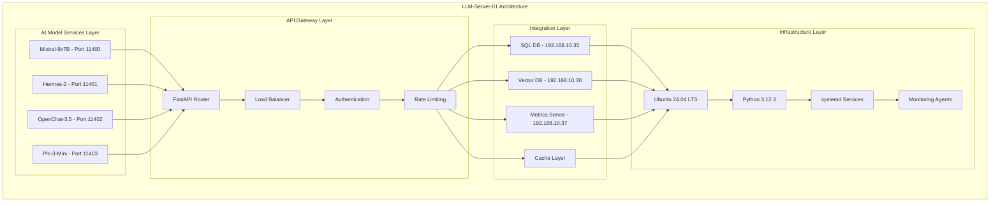
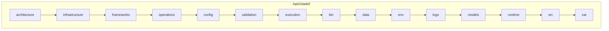
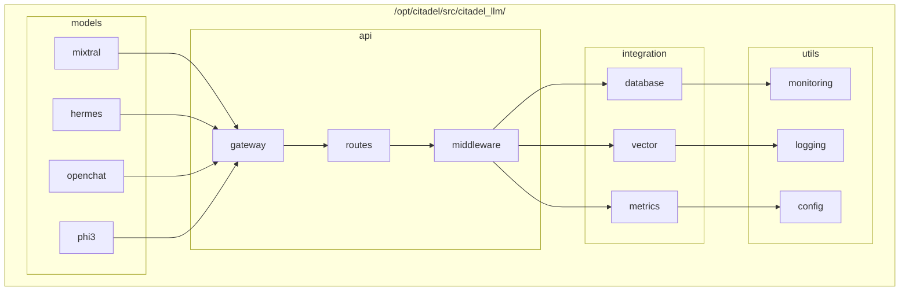

# LLM-Server-01 Product Requirements Document (PRD) - V2

**Document Version:** 2.0  
**Date:** 2025-07-19  
**Author:** Citadel AI Infrastructure Team  
**Project:** HX-Enterprise-LLM-Server-01 Implementation  
**Server:** hx-llm-server-01 (192.168.10.29)  
**Purpose:** General AI inference and research operations  

---

## 1. Executive Summary

### 1.1 Project Overview
The HX-Enterprise-LLM-Server-01 (hx-llm-server-01) is the third critical component of the Citadel AI Operating System infrastructure, designed to provide high-performance AI inference capabilities for general research and development operations. This server will host four specialized AI models with dedicated ports, integrated with existing SQL Database Server (192.168.10.35) and Vector Database Server (192.168.10.30), while leveraging the operational Metrics Server (192.168.10.37). This document provides a comprehensive and detailed specification of the product requirements, ensuring alignment with organizational objectives, technical excellence, and operational readiness.

### 1.2 Strategic Alignment
This implementation aligns with the unified documentation framework and manual task execution structure, incorporating lessons learned from successful Vector Database Server and PostgreSQL Database Server deployments. The server supports the broader Citadel AI ecosystem while maintaining operational excellence and integration consistency. The architecture and implementation will follow the established patterns from the reference documents, ensuring a cohesive and standardized approach across the entire infrastructure.

### 1.3 MVP-Driven Implementation
The implementation follows a three-phase MVP approach to ensure systematic delivery of value while maintaining quality and operational excellence:
- **MVP 1: Core Infrastructure:** Focuses on establishing the essential model hosting and basic integration capabilities, providing a functional baseline for further development.
- **MVP 2: Advanced Features:** Introduces enhanced monitoring, operational tooling, and performance optimization to improve system performance and operational efficiency.
- **MVP 3: Quality Assurance:** Implements comprehensive testing, certification, and production readiness processes to ensure the system meets the highest standards of quality and reliability.

---

## 2. Product Vision and Objectives

### 2.1 Vision Statement
To establish a world-class AI inference server that provides reliable, high-performance access to four specialized AI models while maintaining seamless integration with the Citadel AI infrastructure and supporting advanced research and development operations. The server will be a cornerstone of the Citadel AI ecosystem, enabling innovative research and development initiatives through its robust and scalable architecture.

### 2.2 Primary Objectives
- **High-Performance Inference:** Deliver sub-second response times for all hosted AI models, ensuring a responsive and efficient user experience.
- **Seamless Integration:** Integrate with existing SQL Database, Vector Database, and Metrics servers, creating a cohesive and interconnected infrastructure.
- **Operational Excellence:** Achieve 99%+ uptime with comprehensive monitoring and alerting, ensuring a reliable and stable service.
- **Scalable Architecture:** Support future expansion and additional model deployments, providing a flexible and future-proof solution.
- **Quality Assurance:** Implement comprehensive testing and validation frameworks, ensuring the system meets the highest standards of quality and reliability.

### 2.3 Success Metrics
- **Performance:** Achieve an average response time of less than 2000ms for all models, with a target of less than 1500ms for Mixtral-8x7B and less than 300ms for Phi-3-Mini.
- **Availability:** Maintain 99% uptime during business hours, with a mean time to recovery (MTTR) of less than 5 minutes.
- **Integration:** Achieve 100% successful integration with all external services, with zero integration-related failures.
- **Quality:** Achieve greater than 95% test coverage across all components, with a 100% pass rate for all critical tests.
- **User Satisfaction:** Achieve a user satisfaction rating of greater than 90%, based on regular user feedback and surveys.

---

## 3. Technical Specifications

### 3.1 Server Configuration
- **Hostname:** hx-llm-server-01
- **IP Address:** 192.168.10.29
- **Operating System:** Ubuntu 24.04 LTS
- **Purpose:** General AI inference and research operations
- **Environment:** Development and test environment with minimal security

### 3.2 Hardware Requirements
Based on Vector Database Server and PostgreSQL Server patterns:
- **CPU:** 16+ cores (Intel Xeon or AMD EPYC) to support concurrent model inference and system operations.
- **Memory:** 128GB RAM minimum to accommodate the memory requirements of all four AI models and system processes.
- **Storage:** 6TB NVMe SSD (high-performance storage) to ensure fast model loading and data access.
- **Network:** Gigabit Ethernet with low-latency connectivity to minimize network overhead and ensure fast communication with external services.
- **GPU:** Optional (CPU-focused inference for development environment) to provide flexibility for future GPU-accelerated inference.

### 3.3 AI Model Specifications

#### 3.3.1 Mixtral-8x7B (Port 11400)
- **Model:** Mixtral-8x7B Mixture of Experts, a powerful model for advanced reasoning and complex task handling.
- **Purpose:** Designed for complex tasks requiring deep reasoning and understanding, such as code generation, complex problem solving, and advanced text generation.
- **Memory Requirement:** 90GB to accommodate the large model size and complex architecture.
- **CPU Allocation:** 8 cores to ensure sufficient processing power for the model's demanding computational requirements.
- **Expected Latency:** <2000ms, with a target of <1500ms for optimal user experience.
- **Serving Framework:** vLLM, a high-throughput and memory-efficient inference engine for large language models.

#### 3.3.2 Hermes-2 (Port 11401)
- **Model:** Hermes-2 Conversational AI, a model optimized for natural language conversation and assistance.
- **Purpose:** Ideal for chatbot applications, virtual assistants, and other conversational AI use cases requiring natural and engaging interactions.
- **Memory Requirement:** 30GB to support the model's conversational capabilities and context management.
- **CPU Allocation:** 4 cores to provide sufficient processing power for real-time conversational responses.
- **Expected Latency:** <1500ms, with a target of <1000ms for a responsive conversational experience.
- **Serving Framework:** vLLM, ensuring efficient inference and memory management for the conversational model.

#### 3.3.3 OpenChat-3.5 (Port 11402)
- **Model:** OpenChat-3.5 Open-source Conversational AI, a versatile model for general conversation and task assistance.
- **Purpose:** A general-purpose conversational AI model suitable for a wide range of applications, from simple Q&A to more complex task-oriented dialogues.
- **Memory Requirement:** 25GB to support the model's conversational capabilities and knowledge base.
- **CPU Allocation:** 4 cores to ensure responsive performance for general conversational tasks.
- **Expected Latency:** <1000ms, with a target of <800ms for a smooth and natural conversational flow.
- **Serving Framework:** vLLM, providing a reliable and efficient inference platform for the open-source model.

#### 3.3.4 Phi-3-Mini (Port 11403)
- **Model:** Phi-3-Mini Compact Language Model, a lightweight model designed for rapid response and efficient inference.
- **Purpose:** Ideal for applications requiring fast response times and low computational overhead, such as real-time text completion, summarization, and classification.
- **Memory Requirement:** 8GB to support the compact model size and efficient architecture.
- **CPU Allocation:** 2 cores to provide sufficient processing power for the lightweight model's rapid inference.
- **Expected Latency:** <500ms, with a target of <300ms for near-instantaneous responses.
- **Serving Framework:** vLLM, ensuring optimal performance and efficiency for the compact language model.

### 3.4 Software Stack
- **Python:** 3.12.3 (aligned with existing servers) to ensure consistency and compatibility across the infrastructure.
- **Inference Engine:** vLLM for all models, providing a high-performance and memory-efficient inference platform.
- **API Framework:** FastAPI with OpenAI-compatible endpoints, offering a modern and efficient API framework with automatic documentation.
- **Process Management:** systemd services to ensure reliable and robust process management for all server components.
- **Monitoring:** Prometheus metrics export for comprehensive monitoring and observability.
- **Logging:** Structured logging with correlation IDs to facilitate efficient debugging and analysis.

---

## 4. Architecture and Integration

### 4.1 System Architecture
The LLM-Server-01 follows the established Citadel infrastructure patterns, with a multi-layer architecture designed for performance, scalability, and reliability.



### 4.2 Integration Points

#### 4.2.1 SQL Database Server Integration (192.168.10.35)
- **Connection:** PostgreSQL 17.5 via port 5433 (Pgpool-II) for high-availability and connection pooling.
- **Purpose:** Storing model metadata, user sessions, audit logs, and other structured data.
- **Schema:** A dedicated LLM server schema within the `citadel_ai` database to ensure data isolation and organization.
- **Authentication:** The `citadel_admin` user with appropriate permissions to access the dedicated schema.

#### 4.2.2 Vector Database Server Integration (192.168.10.30)
- **Connection:** Qdrant via the unified API gateway on port 8000, providing a single entry point for all vector database operations.
- **Purpose:** Storing embeddings, performing similarity searches, and retrieving context for the AI models.
- **Collections:** Model-specific collections for each AI model to ensure data separation and efficient querying.
- **API:** Support for REST, GraphQL, and gRPC protocols to accommodate diverse integration needs.

#### 4.2.3 Metrics Server Integration (192.168.10.37)
- **Prometheus:** Exporting metrics to 192.168.10.37:9090 for comprehensive monitoring and observability.
- **Grafana:** Dashboards available at 192.168.10.37:3000 for real-time visualization of system performance and health.
- **Alertmanager:** Alerts configured via 192.168.10.37:9093 for proactive issue detection and notification.
- **WebUI:** A dedicated monitoring dashboard at 192.168.10.37:8080 for a high-level overview of the system status.

### 4.3 Network Configuration
- **Primary Interface:** A static IP address of 192.168.10.29 to ensure consistent network access.
- **Firewall:** Disabled for the development environment to simplify setup and testing.
- **DNS:** Local network resolution for all internal services.
- **Security:** R&D appropriate security measures, with a focus on simplicity for the development environment.

---

## 5. MVP Implementation Strategy

### 5.1 MVP 1: Core Infrastructure

#### 5.1.1 Scope and Objectives
**Primary Goal:** To establish the essential model hosting and basic integration capabilities, providing a functional baseline for further development. This MVP focuses on getting the core system up and running, with all four AI models deployed and accessible via the API gateway.

**Core Components:**
- **Basic Server Setup:** Installation and configuration of the operating system, Python environment, and all necessary dependencies.
- **AI Model Deployment:** Deployment of all four AI models with their respective configurations and serving frameworks.
- **Essential Integration:** Establishing functional connections to the SQL Database, Vector Database, and Metrics servers.
- **Basic API Endpoints:** Implementation of the basic API endpoints for model inference and health checks.
- **Fundamental Monitoring:** Basic monitoring and logging to ensure system visibility and troubleshooting capabilities.

#### 5.1.2 Deliverables
- **Server Infrastructure:** A fully configured Ubuntu 24.04 LTS server with a Python 3.12.3 environment.
- **AI Model Services:** All four AI models operational and responding to inference requests on their dedicated ports.
- **Basic API Gateway:** A functional FastAPI gateway with OpenAI-compatible endpoints for all models.
- **Database Integration:** Validated connections to the SQL and Vector databases, with basic data exchange functionality.
- **Basic Monitoring:** Prometheus metrics export and basic Grafana dashboards for monitoring key system metrics.
- **Essential Documentation:** Basic operational and technical documentation to support the initial deployment.

#### 5.1.3 Success Criteria
- All four AI models must be able to respond to inference requests with a success rate of over 99%.
- The integration with the SQL Database Server (192.168.10.35) must be validated with successful data read/write operations.
- The integration with the Vector Database Server (192.168.10.30) must be validated with successful embedding storage and retrieval.
- Basic metrics must be flowing to the Metrics Server (192.168.10.37) and visible in the Grafana dashboards.
- The API endpoints must be functional and accessible, with a response time of less than 2000ms for all models.
- The basic health checks must be operational and reporting the correct status of all system components.

#### 5.1.4 Technical Requirements
- **Performance:** The system must demonstrate basic functionality with acceptable response times, with a focus on stability and reliability.
- **Availability:** The system must achieve 95% uptime during development hours, with a focus on minimizing downtime.
- **Integration:** The system must establish essential connectivity to all external services, with robust error handling for connection failures.
- **Monitoring:** The system must provide basic metrics collection and alerting for key system events.
- **Documentation:** The system must have essential operational procedures to support the initial deployment and troubleshooting.

### 5.2 MVP 2: Advanced Features

#### 5.2.1 Scope and Objectives
**Primary Goal:** To implement advanced monitoring, operational tooling, and performance optimization to improve system performance and operational efficiency. This MVP focuses on enhancing the core system with advanced features that improve its performance, reliability, and manageability.

**Advanced Components:**
- **Enhanced Monitoring:** Implementation of custom metrics, advanced alerting rules, and comprehensive dashboards.
- **Performance Optimization:** Implementation of model optimization techniques, caching strategies, and load balancing.
- **Advanced API Features:** Implementation of rate limiting, authentication, and advanced routing capabilities.
- **Operational Tooling:** Development of automated deployment, maintenance scripts, and diagnostic tools.
- **Enhanced Integration:** Implementation of enhanced database integration patterns and caching strategies.

#### 5.2.2 Deliverables
- **Advanced Monitoring:** A comprehensive monitoring solution with custom business metrics, advanced alerting rules, and detailed Grafana dashboards.
- **Performance Optimization:** An optimized system with improved response times, reduced resource utilization, and enhanced scalability.
- **Enhanced API Gateway:** A secure and robust API gateway with rate limiting, authentication, and intelligent routing.
- **Operational Tools:** A suite of automated tools for deployment, maintenance, and troubleshooting.
- **Advanced Integration:** An enhanced integration solution with optimized database queries and intelligent caching.
- **Comprehensive Documentation:** Detailed operational and troubleshooting guides to support the advanced features.

#### 5.2.3 Success Criteria
- The custom business metrics (accuracy, satisfaction, cost tracking) must be operational and providing valuable insights.
- The performance targets must be achieved, with an average response time of less than 1500ms for Mixtral-8x7B and less than 300ms for Phi-3-Mini.
- The advanced alerting and anomaly detection must be functional and providing proactive issue detection.
- The operational tools must be deployed and validated, with a significant reduction in manual operational tasks.
- The enhanced API features must be operational and providing a secure and reliable API gateway.
- The comprehensive monitoring dashboards must be available and providing a detailed view of the system's health and performance.

#### 5.2.4 Technical Requirements
- **Performance:** The system must achieve optimized response times meeting the target latencies, with a focus on efficiency and scalability.
- **Availability:** The system must achieve 98% uptime with proactive issue detection and rapid recovery from failures.
- **Monitoring:** The system must provide advanced metrics, alerting, and anomaly detection for comprehensive observability.
- **Operations:** The system must have automated deployment and maintenance capabilities to reduce manual effort and improve reliability.
- **Integration:** The system must have enhanced integration patterns with caching and optimization to improve performance and reliability.

### 5.3 MVP 3: Quality Assurance

#### 5.3.1 Scope and Objectives
**Primary Goal:** To implement comprehensive testing, certification, and production readiness processes to ensure the system meets the highest standards of quality and reliability. This MVP focuses on validating the system's quality, security, and performance, and preparing it for production deployment.

**Quality Components:**
- **Comprehensive Testing:** Implementation of a comprehensive testing framework with unit, integration, performance, and security testing.
- **Code Quality:** Implementation of code quality gates, security scans, and compliance validation.
- **Certification Processes:** Implementation of formal certification and approval procedures.
- **Production Readiness:** Implementation of a complete operational readiness assessment.
- **Complete Documentation:** Creation of a complete documentation suite and handover package.

#### 5.3.2 Deliverables
- **Testing Framework:** A comprehensive testing framework with automated tests for all system components.
- **Quality Gates:** A set of quality gates to ensure code quality, security, and compliance.
- **Certification Process:** A formal certification process with clear approval criteria and procedures.
- **Production Readiness:** A complete production readiness assessment with a detailed report.
- **Documentation Suite:** A complete documentation suite with technical, operational, and user documentation.
- **Handover Package:** A complete handover package for the operations team, with all necessary documentation and training materials.

#### 5.3.3 Success Criteria
- The system must achieve greater than 95% test coverage across all components, with a 100% pass rate for all critical tests.
- All security scans must be passed with no critical vulnerabilities identified.
- The performance benchmarks must be validated under realistic load conditions, with the system meeting all performance targets.
- The certification process must be completed and approved by all stakeholders.
- The production readiness checklist must be 100% complete, with all items validated and approved.
- The operations team must be fully trained and ready for the handover, with a clear understanding of the system's operation and maintenance.

#### 5.3.4 Technical Requirements
- **Quality:** The system must achieve greater than 95% test coverage and quality gate compliance, with a focus on reliability and robustness.
- **Security:** The system must have security validation appropriate for the R&D environment, with a focus on protecting sensitive data and resources.
- **Performance:** The system must have validated performance under realistic load conditions, with a focus on scalability and efficiency.
- **Certification:** The system must have a formal certification and approval process to ensure it meets all requirements and standards.
- **Documentation:** The system must have a complete and comprehensive documentation suite to support its operation and maintenance.

---

## 6. Functional Requirements

### 6.1 Core Functionality

#### 6.1.1 AI Model Inference
- **Requirement:** The system must provide inference capabilities for all four hosted AI models, with a focus on performance, reliability, and accuracy.
- **Specification:** The system must expose OpenAI-compatible API endpoints for each model, ensuring compatibility with existing tools and libraries.
- **Performance:** The system must meet the model-specific latency targets, with a focus on providing a responsive and efficient user experience.
- **Reliability:** The system must achieve a 99% successful inference rate, with robust error handling for failed requests.

#### 6.1.2 API Gateway
- **Requirement:** The system must have a unified API gateway for all model access, providing a single entry point for all API requests.
- **Specification:** The system must use FastAPI with automatic documentation, offering a modern and efficient API framework.
- **Features:** The system must support rate limiting, authentication, and load balancing to ensure a secure and reliable API gateway.
- **Protocols:** The system must use HTTP/HTTPS with JSON request/response, ensuring compatibility with standard web technologies.

#### 6.1.3 Database Integration
- **Requirement:** The system must have seamless integration with the SQL and Vector databases, ensuring efficient data exchange and storage.
- **SQL Integration:** The system must use the SQL database for storing model metadata, user sessions, and audit logs.
- **Vector Integration:** The system must use the Vector database for storing embeddings and performing similarity searches.
- **Performance:** The system must achieve a database query response time of less than 100ms, with a focus on optimizing database queries.

#### 6.1.4 Monitoring and Observability
- **Requirement:** The system must have comprehensive monitoring and alerting capabilities, providing real-time visibility into the system's health and performance.
- **Metrics:** The system must collect performance, availability, and business metrics to provide a complete picture of the system's operation.
- **Alerting:** The system must have proactive alerting for issues and anomalies, ensuring rapid issue detection and resolution.
- **Dashboards:** The system must have real-time operational dashboards for visualizing system performance and health.

### 6.2 Advanced Functionality

#### 6.2.1 Performance Optimization
- **Requirement:** The system must have optimized performance for all models, with a focus on reducing latency and improving throughput.
- **Caching:** The system must implement intelligent caching strategies to reduce the need for repeated computations and data lookups.
- **Load Balancing:** The system must use efficient load balancing techniques to distribute requests evenly across all available resources.
- **Resource Management:** The system must have optimal resource utilization, with a focus on minimizing resource waste and maximizing efficiency.

#### 6.2.2 Operational Tools
- **Requirement:** The system must have a comprehensive suite of operational tools to support its deployment, maintenance, and troubleshooting.
- **Deployment:** The system must have automated deployment and update procedures to reduce manual effort and improve reliability.
- **Maintenance:** The system must have automated maintenance and health check procedures to ensure the system's long-term stability.
- **Diagnostics:** The system must have advanced diagnostic and troubleshooting tools to facilitate rapid issue resolution.

#### 6.2.3 Quality Assurance
- **Requirement:** The system must have a comprehensive quality validation framework to ensure it meets the highest standards of quality and reliability.
- **Testing:** The system must have an automated testing framework with unit, integration, performance, and security testing.
- **Validation:** The system must have continuous validation and monitoring to ensure its ongoing quality and performance.
- **Certification:** The system must have a formal certification process to ensure it meets all requirements and standards.

---

## 7. Non-Functional Requirements

### 7.1 Performance Requirements
- **Response Time:** The system must meet the model-specific latency targets, with a focus on providing a responsive and efficient user experience.
- **Throughput:** The system must support a high number of concurrent requests per model, with a focus on scalability and efficiency.
- **Resource Utilization:** The system must have efficient CPU and memory usage, with a focus on minimizing resource waste.
- **Scalability:** The system must be able to support future model additions and increased workloads, with a focus on providing a flexible and future-proof solution.

### 7.2 Availability Requirements
- **Uptime:** The system must achieve 99% availability during business hours, with a focus on minimizing downtime and ensuring a reliable service.
- **Recovery:** The system must have a recovery time of less than 5 minutes from failures, with a focus on rapid issue resolution.
- **Maintenance:** The system must have planned maintenance windows with minimal impact on users, with a focus on minimizing disruption.
- **Monitoring:** The system must have 24/7 monitoring and alerting to ensure continuous visibility into the system's health and performance.

### 7.3 Security Requirements
- **Authentication:** The system must have basic authentication for the R&D environment, with a focus on simplicity and ease of use.
- **Authorization:** The system must have role-based access control to ensure that users only have access to the resources they need.
- **Data Protection:** The system must have appropriate data protection measures for the development environment, with a focus on protecting sensitive data.
- **Audit:** The system must have a comprehensive audit logging mechanism to track all system activities and events.

### 7.4 Operational Requirements
- **Deployment:** The system must have automated deployment and configuration procedures to reduce manual effort and improve reliability.
- **Monitoring:** The system must have comprehensive monitoring and alerting capabilities to ensure continuous visibility into the system's health and performance.
- **Maintenance:** The system must have automated maintenance and update procedures to ensure the system's long-term stability.
- **Documentation:** The system must have complete operational documentation to support its operation and maintenance.

---

## 8. Integration Requirements

### 8.1 External Service Dependencies

#### 8.1.1 SQL Database Server (192.168.10.35)
- **Status:** ✅ OPERATIONAL
- **Connection:** PostgreSQL 17.5 via Pgpool-II (port 5433) for high-availability and connection pooling.
- **Database:** `citadel_ai`
- **User:** `citadel_admin`
- **Integration Pattern:** Connection pooling with retry logic to ensure a reliable and resilient connection.

#### 8.1.2 Vector Database Server (192.168.10.30)
- **Status:** ✅ OPERATIONAL
- **Connection:** Qdrant via the unified API gateway (port 8000) for a single entry point to all vector database operations.
- **Protocols:** REST, GraphQL, gRPC to accommodate diverse integration needs.
- **Collections:** Model-specific vector collections to ensure data separation and efficient querying.
- **Integration Pattern:** Multi-protocol with caching to improve performance and reliability.

#### 8.1.3 Metrics Server (192.168.10.37)
- **Status:** ✅ OPERATIONAL
- **Prometheus:** 192.168.10.37:9090 for comprehensive monitoring and observability.
- **Grafana:** 192.168.10.37:3000 (admin/admin) for real-time visualization of system performance and health.
- **Alertmanager:** 192.168.10.37:9093 for proactive issue detection and notification.
- **WebUI:** 192.168.10.37:8080 for a high-level overview of the system status.
- **Integration Pattern:** Metrics export with custom dashboards to provide a complete picture of the system's operation.

### 8.2 Integration Patterns
Based on successful Vector Database and PostgreSQL implementations:
- **Connection Pooling:** Efficient database connection management to reduce overhead and improve performance.
- **Retry Logic:** Exponential backoff with circuit breaker patterns to ensure a reliable and resilient connection.
- **Health Checks:** Regular connectivity validation to ensure the health and availability of all external services.
- **Caching:** Redis-backed caching for performance optimization to reduce the need for repeated computations and data lookups.
- **Monitoring:** Comprehensive metrics and alerting integration to provide continuous visibility into the system's health and performance.

---

## 9. Technical Architecture

### 9.1 Directory Structure
Following the manual task execution structure and unified documentation framework:



### 9.2 Service Architecture

#### 9.2.1 AI Model Services



#### 9.2.2 Configuration Management

```yaml
# Model configuration structure
models:
  mixtral:
    port: 11400
    memory: "90GB"
    cpu_cores: 8
    max_tokens: 32768
    temperature: 0.7
  hermes:
    port: 11401
    memory: "30GB"
    cpu_cores: 4
    max_tokens: 8192
    temperature: 0.7
  openchat:
    port: 11402
    memory: "25GB"
    cpu_cores: 4
    max_tokens: 8192
    temperature: 0.7
  phi3:
    port: 11403
    memory: "8GB"
    cpu_cores: 2
    max_tokens: 4096
    temperature: 0.7
```

---

## 10. Risk Management

### 10.1 Technical Risks

#### 10.1.1 Model Performance Risk
- **Risk:** The AI models may not meet the specified performance targets, leading to a poor user experience.
- **Likelihood:** Medium
- **Impact:** High
- **Mitigation:** Comprehensive performance testing and optimization during MVP 1 and MVP 2, with a focus on identifying and resolving performance bottlenecks.

#### 10.1.2 Integration Complexity Risk
- **Risk:** The integration with multiple external services may be more complex than anticipated, leading to delays and integration issues.
- **Likelihood:** Medium
- **Impact:** Medium
- **Mitigation:** Leveraging proven integration patterns from existing implementations, with a focus on creating a robust and resilient integration solution.

#### 10.1.3 Resource Constraints Risk
- **Risk:** The server may not have sufficient hardware resources to support all four AI models, leading to performance degradation and instability.
- **Likelihood:** Low
- **Impact:** High
- **Mitigation:** Comprehensive resource monitoring and optimization strategies, with a focus on ensuring efficient resource utilization.

### 10.2 Operational Risks

#### 10.2.1 Dependency Risk
- **Risk:** The unavailability of external services may affect the integration and overall system functionality.
- **Likelihood:** Low
- **Impact:** Medium
- **Mitigation:** Implementing robust error handling and fallback mechanisms to minimize the impact of external service failures.

### 10.3 Quality Risks

#### 10.3.1 Testing Coverage Risk
- **Risk:** Insufficient testing may lead to quality issues and bugs in the production environment.
- **Likelihood:** Low
- **Impact:** High
- **Mitigation:** Implementing a comprehensive testing framework in MVP 3, with a focus on achieving high test coverage and quality.

#### 10.3.2 Documentation Risk
- **Risk:** Incomplete or inaccurate documentation may affect the system's operation and maintenance.
- **Likelihood:** Low
- **Impact:** Medium
- **Mitigation:** Implementing documentation requirements in each MVP phase, with a focus on creating a complete and comprehensive documentation suite.

---

## 11. Success Metrics and KPIs

### 11.1 Performance Metrics
- **Mixtral-8x7B Response Time:** <2000ms (Target: <1500ms)
- **Hermes-2 Response Time:** <1500ms (Target: <1000ms)
- **OpenChat-3.5 Response Time:** <1000ms (Target: <800ms)
- **Phi-3-Mini Response Time:** <500ms (Target: <300ms)
- **Overall System Availability:** >99%
- **Database Query Response Time:** <100ms

### 11.2 Quality Metrics
- **Test Coverage:** >95%
- **Security Scan Pass Rate:** 100%
- **Integration Test Success Rate:** >98%
- **Performance Test Pass Rate:** 100%
- **Documentation Completeness:** 100%

### 11.3 Operational Metrics
- **Deployment Success Rate:** 100%
- **Mean Time to Recovery (MTTR):** <5 minutes
- **Monitoring Coverage:** 100%
- **Alert Response Time:** <2 minutes
- **User Satisfaction:** >90%

---

## 12. Compliance and Governance

### 12.1 Documentation Framework Compliance
- **Architecture Alignment:** 100% compliance with the unified architecture baseline, ensuring a consistent and standardized approach.
- **Implementation Standards:** Adherence to the implementation frameworks, with a focus on creating a high-quality and maintainable system.
- **Operational Procedures:** Compliance with the standardized operational procedures, with a focus on ensuring a reliable and stable service.
- **Configuration Management:** Alignment with the server-specific configuration standards, with a focus on creating a consistent and manageable configuration.
- **Validation Requirements:** Full compliance with the integration validation procedures, with a focus on ensuring a robust and reliable integration.

### 12.2 Quality Gates
- **MVP 1 Gate:** Validation of core functionality and basic integration, ensuring a functional baseline for further development.
- **MVP 2 Gate:** Achievement of advanced features and performance targets, ensuring an optimized and efficient system.
- **MVP 3 Gate:** Confirmation of quality assurance and production readiness, ensuring a high-quality and reliable system.
- **Final Gate:** Complete validation and operational handover, ensuring a smooth transition to the operations team.

### 12.3 Approval Process
- **Technical Review:** A comprehensive review of the architecture and implementation to ensure technical excellence.
- **Quality Review:** A thorough review of the testing and validation results to ensure high quality and reliability.
- **Operational Review:** A detailed review of the operational readiness to ensure a smooth and stable operation.
- **Final Approval:** Stakeholder approval for production deployment, ensuring alignment with organizational objectives.

---

## 13. Conclusion

### 13.1 Strategic Value
The HX-Enterprise-LLM-Server-01 represents a critical component of the Citadel AI Operating System, providing essential AI inference capabilities while maintaining seamless integration with existing infrastructure. The MVP-driven approach ensures the systematic delivery of value while maintaining quality and operational excellence. This PRD provides a comprehensive and detailed specification of the product requirements, ensuring alignment with organizational objectives, technical excellence, and operational readiness.

### 13.2 Implementation Readiness
This PRD provides comprehensive specifications for implementing LLM-Server-01 with:
- **Clear Technical Requirements:** Detailed specifications for all components, ensuring a clear understanding of the system's requirements.
- **Proven Integration Patterns:** Leveraging successful patterns from existing servers, ensuring a robust and reliable integration.
- **Systematic Implementation:** An MVP-driven approach with clear milestones, ensuring a systematic and efficient implementation.
- **Quality Assurance:** A comprehensive testing and validation framework, ensuring a high-quality and reliable system.
- **Operational Excellence:** Complete operational procedures and documentation, ensuring a smooth and stable operation.

### 13.3 Next Steps
1. **PRD Review and Approval:** Stakeholder review and approval of the requirements to ensure alignment with organizational objectives.
2. **Architecture Document Development:** Development of a detailed technical architecture specification to guide the implementation.
3. **Implementation Planning:** Detailed task planning and resource allocation to ensure a smooth and efficient implementation.
4. **MVP 1 Implementation:** Beginning of the core infrastructure development to establish a functional baseline.
5. **Continuous Validation:** Ongoing validation and quality assurance to ensure a high-quality and reliable system.

This PRD serves as the foundational document for the successful implementation of LLM-Server-01, ensuring alignment with organizational objectives, technical excellence, and operational readiness. It provides a comprehensive and detailed specification of the product requirements, ensuring a clear understanding of the system's scope, functionality, and quality standards.

