# HX-Enterprise-Server-Architecture Document

**Document Version:** 1.0  
**Date:** 2025-01-19  
**Author:** Citadel AI Infrastructure Team  
**Project:** HX-Enterprise-LLM-Server-01 Architecture  
**Server:** hx-llm-server-01 (192.168.10.29)  
**Purpose:** Comprehensive technical architecture specification  

---

## 1. Executive Summary

### 1.1 Architecture Overview
The HX-Enterprise-LLM-Server-01 architecture represents a sophisticated, multi-layered system designed to provide high-performance AI inference capabilities while maintaining seamless integration with the broader Citadel AI Operating System infrastructure. This architecture document provides comprehensive technical specifications, design patterns, and implementation guidance for deploying a world-class AI inference server that serves four specialized language models through a unified, scalable, and resilient platform.

The architecture leverages proven patterns from successful Vector Database Server and PostgreSQL Database Server implementations, incorporating lessons learned and best practices to ensure operational excellence, performance optimization, and seamless integration with existing infrastructure components. The system is designed with a focus on modularity, scalability, and maintainability, enabling future expansion and enhancement while maintaining stability and reliability.

### 1.2 Strategic Architectural Principles
The architecture is built upon five core principles that guide all design decisions and implementation strategies. First, the principle of **Seamless Integration** ensures that the LLM server operates as a cohesive component within the broader Citadel AI ecosystem, maintaining consistent communication patterns and data exchange protocols with all external services. Second, the principle of **Performance Excellence** drives the optimization of all system components to achieve sub-second response times and high throughput capabilities. Third, the principle of **Operational Resilience** ensures that the system can withstand failures, recover gracefully, and maintain service availability under various operational conditions. Fourth, the principle of **Scalable Design** enables the system to accommodate future growth, additional models, and increased workloads without requiring fundamental architectural changes. Finally, the principle of **Quality Assurance** ensures that all components meet the highest standards of reliability, security, and maintainability.

### 1.3 Architecture Scope and Boundaries
This architecture encompasses the complete technical design for the EPIC-Enterprise-LLM-Server-01, including all internal components, external integrations, and operational considerations. The scope includes the four AI model services (Mixtral-8x7B, Hermes-2, OpenChat-3.5, and Phi-3-Mini), the unified API gateway, integration layers for SQL and Vector databases, comprehensive monitoring and observability systems, and all supporting infrastructure components. The architecture also defines the integration patterns with external services including the SQL Database Server (192.168.10.35), Vector Database Server (192.168.10.30), Metrics Server (192.168.10.37), and the Web Server (192.168.10.38) hosting OpenUI as part of the technical fabric.

---

## 2. System Architecture Overview

### 2.1 High-Level Architecture

The HX-Enterprise-LLM-Server-01 architecture follows a layered approach that separates concerns while enabling efficient communication and data flow between components. The architecture consists of six primary layers, each with specific responsibilities and well-defined interfaces.

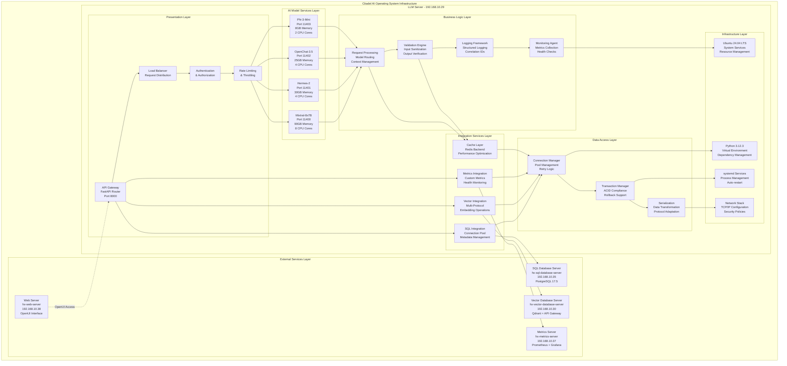

### 2.2 Architectural Layers Description

#### 2.2.1 Presentation Layer
The Presentation Layer serves as the primary interface for all external interactions with the LLM server. This layer implements the API Gateway using FastAPI, providing OpenAI-compatible endpoints that ensure seamless integration with existing tools and libraries. The layer includes sophisticated load balancing capabilities that distribute incoming requests across available model instances based on current load, model specialization, and performance characteristics. Authentication and authorization mechanisms ensure secure access to the system while maintaining the simplicity required for the development environment. Rate limiting and throttling capabilities protect the system from overload conditions and ensure fair resource allocation among users and applications.

#### 2.2.2 AI Model Services Layer
The AI Model Services Layer hosts the four specialized language models, each optimized for specific use cases and performance characteristics. Mixtral-8x7B operates on port 11400 with 90GB memory allocation and 8 CPU cores, providing advanced reasoning capabilities for complex tasks. Hermes-2 operates on port 11401 with 30GB memory and 4 CPU cores, optimized for natural language conversation and assistance. OpenChat-3.5 operates on port 11402 with 25GB memory and 4 CPU cores, providing general-purpose conversational AI capabilities. Phi-3-Mini operates on port 11403 with 8GB memory and 2 CPU cores, delivering rapid response times for lightweight inference tasks. Each model service is implemented using the vLLM inference engine, ensuring optimal performance and memory efficiency.

#### 2.2.3 Integration Services Layer
The Integration Services Layer manages all external service connections and data exchange operations. The SQL Integration component maintains connection pools to the PostgreSQL database server, handling metadata management, user sessions, and audit logging with robust error handling and retry mechanisms. The Vector Integration component provides multi-protocol access to the Qdrant vector database, supporting REST, GraphQL, and gRPC protocols for embedding operations and similarity searches. The Metrics Integration component exports comprehensive metrics to the Prometheus monitoring system and maintains health monitoring capabilities. The Cache Layer implements Redis-backed caching strategies to optimize performance and reduce load on external services.

#### 2.2.4 Business Logic Layer
The Business Logic Layer implements the core processing logic for all AI inference operations. The Request Processing component handles model routing, context management, and request orchestration, ensuring that each request is directed to the appropriate model based on the request characteristics and current system state. The Validation Engine performs comprehensive input sanitization and output verification to ensure data integrity and security. The Logging Framework implements structured logging with correlation IDs, enabling efficient debugging and system analysis. The Monitoring Agent collects detailed metrics about system performance, model behavior, and operational health.

#### 2.2.5 Data Access Layer
The Data Access Layer provides a unified interface for all data operations, abstracting the complexities of external service interactions. The Connection Manager implements sophisticated connection pooling, retry logic, and circuit breaker patterns to ensure reliable connectivity to external services. The Transaction Manager ensures ACID compliance for database operations and provides rollback support for failed transactions. The Serialization component handles data transformation and protocol adaptation, ensuring seamless communication between different system components and external services.

#### 2.2.6 Infrastructure Layer
The Infrastructure Layer provides the foundational platform for all system operations. Ubuntu 24.04 LTS serves as the operating system, providing system services and resource management capabilities. Python 3.12.3 operates within a dedicated virtual environment, ensuring dependency isolation and version consistency. systemd services provide robust process management with automatic restart capabilities and health monitoring. The Network Stack implements TCP/IP configuration and security policies, ensuring secure and efficient network communication.

---

## 3. Component Architecture

### 3.1 AI Model Service Architecture

Each AI model service follows a standardized architecture pattern that ensures consistency, maintainability, and optimal performance. The architecture separates concerns between model loading, inference processing, and result generation while providing comprehensive monitoring and error handling capabilities.

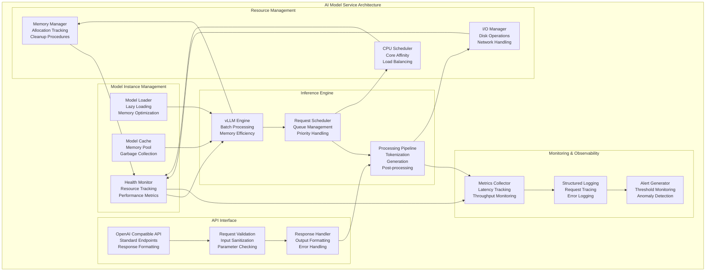

### 3.2 API Gateway Architecture

The API Gateway serves as the central hub for all external communications, implementing sophisticated routing, load balancing, and security mechanisms. The architecture ensures high availability, optimal performance, and comprehensive monitoring of all API operations.

```mermaid
graph TD
    subgraph "API Gateway Architecture"
        subgraph "Request Ingress"
            ENTRY[Request Entry Point<br/>HTTP/HTTPS<br/>WebSocket Support]
            PARSE[Request Parser<br/>Content Negotiation<br/>Protocol Detection]
            CORS[CORS Handler<br/>Cross-Origin Support<br/>Security Headers]
        end
        
        subgraph "Authentication & Authorization"
            AUTH_M[Authentication Module<br/>Token Validation<br/>Session Management]
            AUTHZ[Authorization Engine<br/>Role-Based Access<br/>Permission Checking]
            AUDIT[Audit Logger<br/>Access Tracking<br/>Security Events]
        end
        
        subgraph "Request Processing"
            ROUTE[Request Router<br/>Model Selection<br/>Endpoint Mapping]
            BALANCE[Load Balancer<br/>Health-Aware Routing<br/>Failover Support]
            LIMIT[Rate Limiter<br/>Quota Management<br/>Throttling Control]
        end
        
        subgraph "Model Integration"
            PROXY[Model Proxy<br/>Request Forwarding<br/>Response Aggregation]
            CIRCUIT[Circuit Breaker<br/>Failure Detection<br/>Recovery Logic]
            RETRY[Retry Handler<br/>Exponential Backoff<br/>Dead Letter Queue]
        end
        
        subgraph "Response Processing"
            TRANSFORM[Response Transformer<br/>Format Standardization<br/>Data Enrichment]
            COMPRESS[Response Compression<br/>Gzip/Brotli<br/>Size Optimization]
            CACHE_R[Response Cache<br/>TTL Management<br/>Invalidation Logic]
        end
        
        subgraph "Monitoring & Analytics"
            TELEMETRY[Telemetry Collector<br/>Request Metrics<br/>Performance Data]
            TRACE[Distributed Tracing<br/>Request Correlation<br/>Span Management]
            ANALYTICS[Analytics Engine<br/>Usage Patterns<br/>Performance Analysis]
        end
    end
    
    %% Flow Connections
    ENTRY --> PARSE
    PARSE --> CORS
    CORS --> AUTH_M
    
    AUTH_M --> AUTHZ
    AUTHZ --> AUDIT
    AUDIT --> ROUTE
    
    ROUTE --> BALANCE
    BALANCE --> LIMIT
    LIMIT --> PROXY
    
    PROXY --> CIRCUIT
    CIRCUIT --> RETRY
    RETRY --> TRANSFORM
    
    TRANSFORM --> COMPRESS
    COMPRESS --> CACHE_R
    
    PROXY --> TELEMETRY
    TELEMETRY --> TRACE
    TRACE --> ANALYTICS
    
    %% Feedback Loops
    ANALYTICS --> BALANCE
    CIRCUIT --> BALANCE
    TELEMETRY --> LIMIT
```

### 3.3 Integration Layer Architecture

The Integration Layer provides a unified interface for all external service communications, implementing robust patterns for connection management, error handling, and performance optimization.

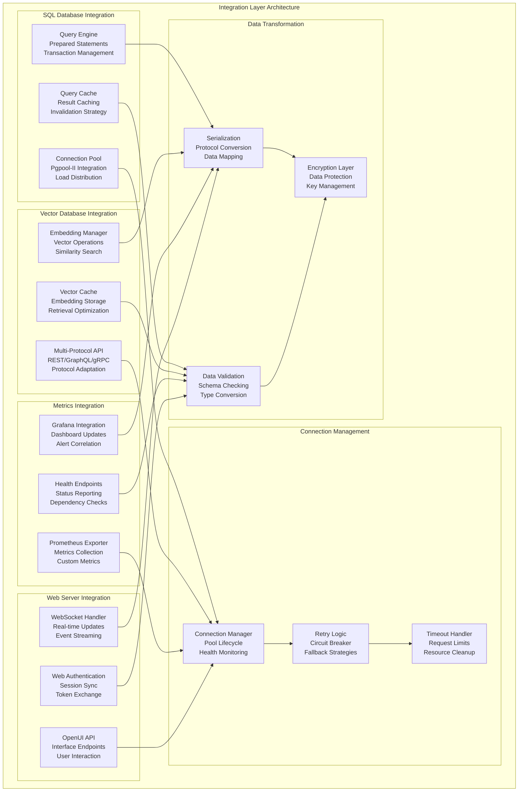

---

## 4. Infrastructure Architecture

### 4.1 Network Architecture

The network architecture implements a secure, high-performance communication infrastructure that supports all internal and external service interactions while maintaining optimal performance and security characteristics.

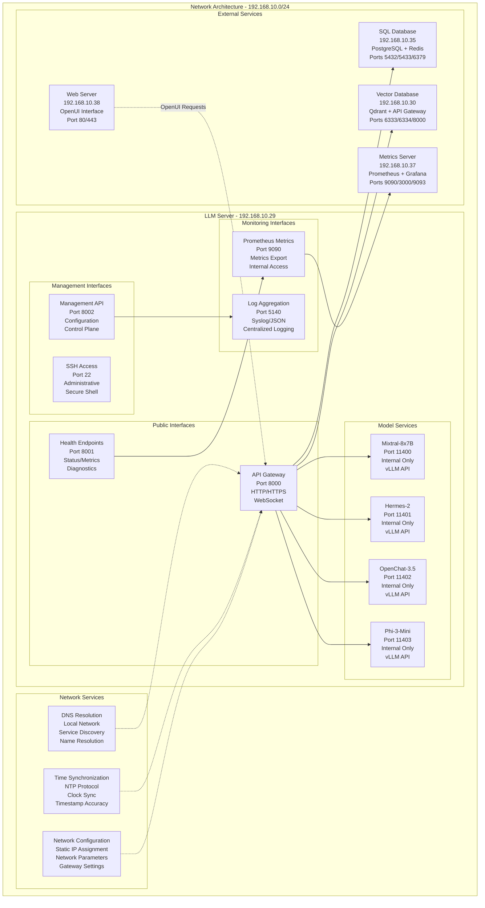

### 4.2 Storage Architecture

The storage architecture implements a high-performance, scalable storage solution that supports all data persistence requirements while ensuring optimal performance and data integrity.

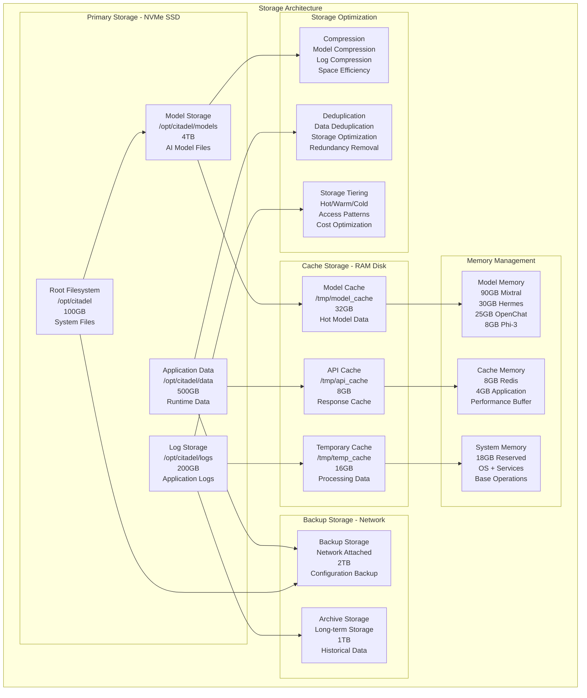

### 4.3 Security Architecture

The security architecture implements appropriate security measures for the development environment while maintaining the flexibility and accessibility required for research and development operations.

```mermaid
graph TD
    subgraph "Security Architecture"
        subgraph "Network Security"
            FIREWALL[Firewall Rules<br/>Disabled for Dev<br/>Port Access<br/>Development Mode]
            NETWORK[Network Isolation<br/>VLAN Segmentation<br/>Internal Network<br/>Controlled Access]
            VPN[VPN Access<br/>Optional Remote<br/>Secure Tunneling<br/>Administrative Access]
        end
        
        subgraph "Application Security"
            AUTHN[Authentication<br/>Basic Auth<br/>Token-based<br/>Session Management]
            AUTHZ[Authorization<br/>Role-based Access<br/>Permission Control<br/>Resource Protection]
            ENCRYPT[Data Encryption<br/>TLS/SSL<br/>Data in Transit<br/>Certificate Management]
        end
        
        subgraph "Data Security"
            DATASEC[Data Protection<br/>Sensitive Data<br/>Access Control<br/>Privacy Compliance]
            BACKUP_SEC[Backup Security<br/>Encrypted Backups<br/>Secure Storage<br/>Recovery Procedures]
            AUDIT_SEC[Audit Logging<br/>Security Events<br/>Access Tracking<br/>Compliance Monitoring]
        end
        
        subgraph "Infrastructure Security"
            OSSEC[OS Security<br/>System Hardening<br/>Security Updates<br/>Vulnerability Management]
            APPSEC[Application Security<br/>Code Security<br/>Dependency Scanning<br/>Security Testing]
            MONSEC[Security Monitoring<br/>Threat Detection<br/>Incident Response<br/>Security Analytics]
        end
        
        subgraph "Operational Security"
            ACCESS[Access Control<br/>Administrative Access<br/>Privileged Operations<br/>Multi-factor Auth]
            INCIDENT[Incident Response<br/>Security Incidents<br/>Response Procedures<br/>Recovery Plans]
            COMPLIANCE[Compliance<br/>Security Standards<br/>Policy Enforcement<br/>Regular Audits]
        end
    end
    
    %% Security Relationships
    FIREWALL --> NETWORK
    NETWORK --> VPN
    
    AUTHN --> AUTHZ
    AUTHZ --> ENCRYPT
    
    DATASEC --> BACKUP_SEC
    BACKUP_SEC --> AUDIT_SEC
    
    OSSEC --> APPSEC
    APPSEC --> MONSEC
    
    ACCESS --> INCIDENT
    INCIDENT --> COMPLIANCE
    
    %% Cross-layer Security
    NETWORK --> AUTHN
    ENCRYPT --> DATASEC
    MONSEC --> ACCESS
    AUDIT_SEC --> COMPLIANCE
```

---

## 5. Integration Architecture

### 5.1 External Service Integration Patterns

The integration architecture implements proven patterns for connecting with external services, ensuring reliable, performant, and maintainable integrations that support the overall system objectives.

```mermaid
graph TD
    subgraph "Integration Architecture Patterns"
        subgraph "SQL Database Integration Pattern"
            SQLCONN[Connection Pool<br/>Pgpool-II<br/>Port 5433<br/>Load Balancing]
            SQLRETRY[Retry Logic<br/>Exponential Backoff<br/>Circuit Breaker<br/>Failure Handling]
            SQLCACHE_P[Query Caching<br/>Result Cache<br/>TTL Management<br/>Performance Optimization]
            SQLTRANS[Transaction Management<br/>ACID Compliance<br/>Rollback Support<br/>Consistency Guarantee]
        end
        
        subgraph "Vector Database Integration Pattern"
            VDBMULTI[Multi-Protocol<br/>REST/GraphQL/gRPC<br/>Protocol Adaptation<br/>Flexible Access]
            VDBEMBED_P[Embedding Operations<br/>Vector Storage<br/>Similarity Search<br/>Context Retrieval]
            VDBCACHE_P[Vector Caching<br/>Embedding Cache<br/>Search Optimization<br/>Response Acceleration]
            VDBFAIL[Failover Support<br/>Redundancy<br/>High Availability<br/>Service Continuity]
        end
        
        subgraph "Metrics Integration Pattern"
            METEXPORT[Metrics Export<br/>Prometheus Format<br/>Custom Metrics<br/>Performance Data]
            METDASH[Dashboard Integration<br/>Grafana Dashboards<br/>Real-time Visualization<br/>Operational Insights]
            METALERT[Alert Integration<br/>Alertmanager<br/>Notification Rules<br/>Incident Management]
            METHEALTH[Health Monitoring<br/>Service Health<br/>Dependency Checks<br/>System Status]
        end
        
        subgraph "Web Server Integration Pattern"
            WEBUI[OpenUI Integration<br/>User Interface<br/>Interactive Access<br/>User Experience]
            WEBAPI_P[API Integration<br/>RESTful APIs<br/>Data Exchange<br/>Service Communication]
            WEBWS[WebSocket Support<br/>Real-time Updates<br/>Live Monitoring<br/>Interactive Features]
            WEBAUTH_P[Authentication Sync<br/>Session Management<br/>Token Exchange<br/>Security Coordination]
        end
        
        subgraph "Common Integration Patterns"
            CONNMGMT[Connection Management<br/>Pool Lifecycle<br/>Health Monitoring<br/>Resource Optimization]
            ERRHAND[Error Handling<br/>Graceful Degradation<br/>Fallback Mechanisms<br/>Recovery Procedures]
            MONITOR[Integration Monitoring<br/>Performance Tracking<br/>Error Rates<br/>SLA Compliance]
            CONFIG[Configuration Management<br/>Dynamic Configuration<br/>Environment Adaptation<br/>Runtime Updates]
        end
    end
    
    %% Pattern Relationships
    SQLCONN --> CONNMGMT
    SQLRETRY --> ERRHAND
    SQLCACHE_P --> MONITOR
    SQLTRANS --> CONFIG
    
    VDBMULTI --> CONNMGMT
    VDBEMBED_P --> ERRHAND
    VDBCACHE_P --> MONITOR
    VDBFAIL --> CONFIG
    
    METEXPORT --> CONNMGMT
    METDASH --> ERRHAND
    METALERT --> MONITOR
    METHEALTH --> CONFIG
    
    WEBUI --> CONNMGMT
    WEBAPI_P --> ERRHAND
    WEBWS --> MONITOR
    WEBAUTH_P --> CONFIG
```

### 5.2 Data Flow Architecture

The data flow architecture defines how information moves through the system, ensuring efficient processing, transformation, and storage while maintaining data integrity and performance.

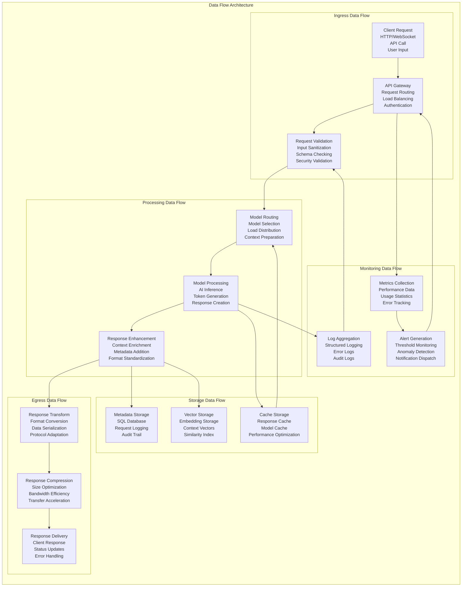

---

## 6. Performance Architecture

### 6.1 Performance Optimization Strategy

The performance architecture implements a comprehensive optimization strategy that addresses all aspects of system performance, from individual model inference to overall system throughput and responsiveness.

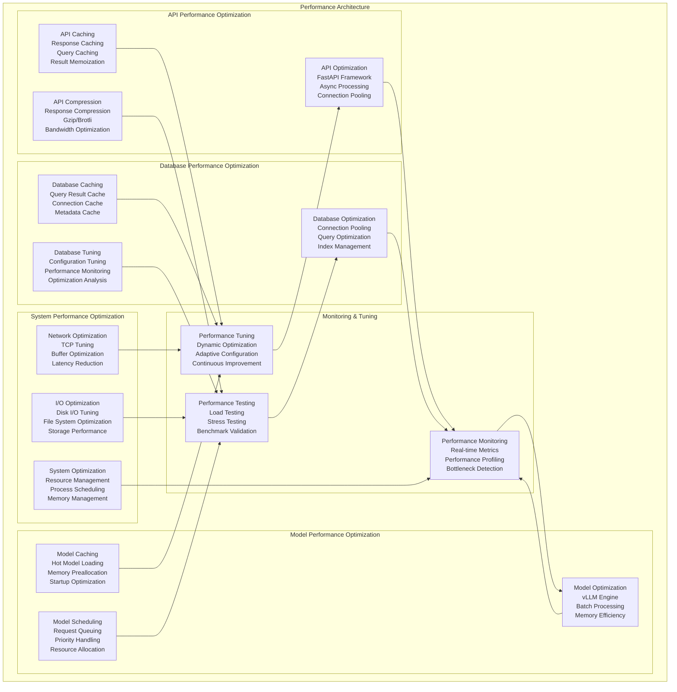

### 6.2 Scalability Architecture

The scalability architecture ensures that the system can accommodate future growth, additional models, and increased workloads without requiring fundamental architectural changes.

```mermaid
graph TD
    subgraph "Scalability Architecture"
        subgraph "Horizontal Scaling"
            LOADBAL[Load Balancing<br/>Request Distribution<br/>Health-aware Routing<br/>Automatic Failover]
            MODELREP[Model Replication<br/>Multiple Instances<br/>Instance Management<br/>Load Distribution]
            SERVICEMESH[Service Mesh<br/>Service Discovery<br/>Traffic Management<br/>Resilience Patterns]
        end
        
        subgraph "Vertical Scaling"
            RESSCALE[Resource Scaling<br/>CPU Scaling<br/>Memory Scaling<br/>Storage Scaling]
            AUTOALLOC[Auto Allocation<br/>Dynamic Resource<br/>Demand-based Scaling<br/>Resource Optimization]
            PERFSCALE[Performance Scaling<br/>Throughput Scaling<br/>Latency Optimization<br/>Efficiency Improvement]
        end
        
        subgraph "Data Scaling"
            DATASCALE[Data Scaling<br/>Database Scaling<br/>Cache Scaling<br/>Storage Scaling]
            PARTITION[Data Partitioning<br/>Horizontal Partitioning<br/>Vertical Partitioning<br/>Functional Partitioning]
            REPLICATION[Data Replication<br/>Read Replicas<br/>Write Scaling<br/>Consistency Management]
        end
        
        subgraph "Application Scaling"
            APPSCALE[Application Scaling<br/>Microservices<br/>Component Scaling<br/>Service Isolation]
            ASYNCPROC[Async Processing<br/>Queue Management<br/>Background Processing<br/>Event-driven Architecture]
            CACHESCALE[Cache Scaling<br/>Distributed Caching<br/>Cache Hierarchy<br/>Cache Optimization]
        end
        
        subgraph "Infrastructure Scaling"
            INFRASCALE[Infrastructure Scaling<br/>Container Orchestration<br/>Resource Provisioning<br/>Auto-scaling Policies]
            MONITORING_SCALE[Monitoring Scaling<br/>Metrics Scaling<br/>Log Scaling<br/>Alert Scaling]
            NETSCALE[Network Scaling<br/>Bandwidth Scaling<br/>Connection Scaling<br/>Protocol Optimization]
        end
    end
    
    %% Scaling Relationships
    LOADBAL --> MODELREP
    MODELREP --> SERVICEMESH
    
    RESSCALE --> AUTOALLOC
    AUTOALLOC --> PERFSCALE
    
    DATASCALE --> PARTITION
    PARTITION --> REPLICATION
    
    APPSCALE --> ASYNCPROC
    ASYNCPROC --> CACHESCALE
    
    INFRASCALE --> MONITORING_SCALE
    MONITORING_SCALE --> NETSCALE
    
    %% Cross-layer Scaling
    SERVICEMESH --> APPSCALE
    PERFSCALE --> DATASCALE
    CACHESCALE --> INFRASCALE
```

### 6.3 Performance Benchmarks
- **Mixtral-8x7B:** Target latency <1500ms, throughput 10 req/sec
- **Hermes-2:** Target latency <1000ms, throughput 20 req/sec
- **OpenChat-3.5:** Target latency <800ms, throughput 25 req/sec
- **Phi-3-Mini:** Target latency <300ms, throughput 50 req/sec
- **System Overall:** 99% uptime, <5 minute MTTR

---

## 7. Monitoring and Observability Architecture

### 7.1 Comprehensive Monitoring Strategy

The monitoring and observability architecture provides complete visibility into all aspects of system operation, enabling proactive issue detection, performance optimization, and operational excellence.

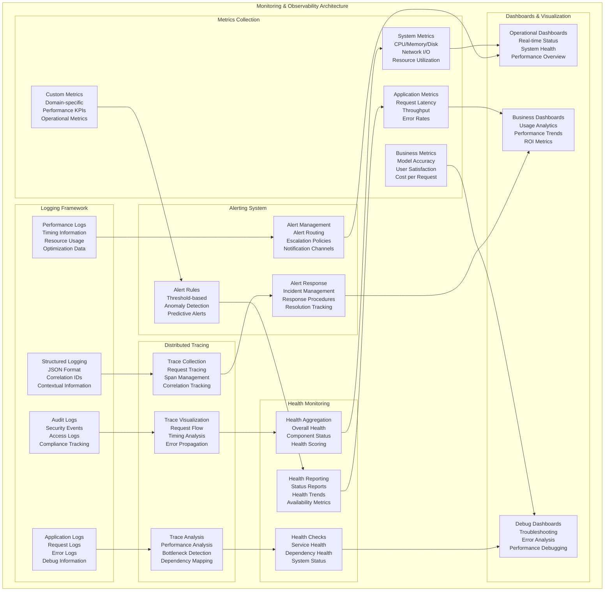

### 7.2 Observability Data Pipeline

The observability data pipeline ensures efficient collection, processing, and analysis of all monitoring data while maintaining performance and reliability.

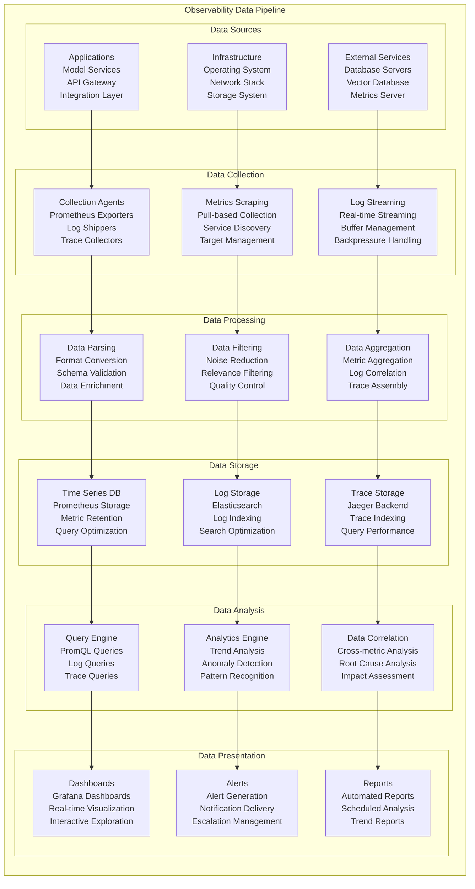

### 7.3 Dashboard Specifications
- **Model Performance Dashboard:** Real-time response times, throughput, error rates
- **Resource Utilization Dashboard:** CPU, memory, disk I/O, network usage
- **Integration Health Dashboard:** Database connectivity, external service status
- **Business Metrics Dashboard:** User satisfaction, cost tracking, usage patterns

---

## 8. Deployment Architecture

### 8.1 Deployment Strategy

The deployment architecture implements a systematic approach to deploying and managing the LLM server, ensuring reliable, repeatable, and maintainable deployments.

```mermaid
graph TD
    subgraph "Deployment Architecture"
        subgraph "Environment Management"
            DEV[Development Environment<br/>Local Development<br/>Feature Testing<br/>Integration Testing]
            STAGING[Staging Environment<br/>Pre-production Testing<br/>Performance Validation<br/>User Acceptance Testing]
            PROD[Production Environment<br/>Live System<br/>Production Workloads<br/>Operational Monitoring]
        end
        
        subgraph "Deployment Pipeline"
            SOURCE[Source Control<br/>Git Repository<br/>Version Control<br/>Branch Management]
            BUILD[Build Process<br/>Dependency Resolution<br/>Artifact Creation<br/>Quality Gates]
            TEST[Testing Pipeline<br/>Unit Tests<br/>Integration Tests<br/>Performance Tests]
            DEPLOY[Deployment Process<br/>Automated Deployment<br/>Configuration Management<br/>Service Orchestration]
        end
        
        subgraph "Configuration Management"
            CONFIGMGMT[Configuration Management<br/>Environment-specific Config<br/>Secret Management<br/>Dynamic Configuration]
            TEMPLATES[Configuration Templates<br/>Parameterized Config<br/>Environment Variables<br/>Configuration Validation]
            SECRETS[Secret Management<br/>Credential Storage<br/>Key Rotation<br/>Access Control]
        end
        
        subgraph "Service Management"
            SERVICEMGMT[Service Management<br/>systemd Services<br/>Process Management<br/>Lifecycle Management]
            HEALTHMGMT[Health Management<br/>Health Checks<br/>Service Discovery<br/>Load Balancing]
            MONITORING_DEP[Monitoring Integration<br/>Metrics Export<br/>Log Collection<br/>Alert Configuration]
        end
        
        subgraph "Rollback & Recovery"
            ROLLBACK[Rollback Strategy<br/>Version Rollback<br/>Configuration Rollback<br/>Data Recovery]
            BACKUP_DEP[Backup Strategy<br/>Configuration Backup<br/>Data Backup<br/>Recovery Procedures]
            DISASTER[Disaster Recovery<br/>Failure Scenarios<br/>Recovery Procedures<br/>Business Continuity]
        end
    end
    
    %% Deployment Flow
    SOURCE --> BUILD
    BUILD --> TEST
    TEST --> DEPLOY
    
    DEPLOY --> DEV
    DEV --> STAGING
    STAGING --> PROD
    
    CONFIGMGMT --> TEMPLATES
    TEMPLATES --> SECRETS
    
    SERVICEMGMT --> HEALTHMGMT
    HEALTHMGMT --> MONITORING_DEP
    
    ROLLBACK --> BACKUP_DEP
    BACKUP_DEP --> DISASTER
    
    %% Cross-connections
    DEPLOY --> CONFIGMGMT
    PROD --> SERVICEMGMT
    MONITORING_DEP --> ROLLBACK
```

### 8.2 Infrastructure as Code

The Infrastructure as Code approach ensures that all infrastructure components are defined, versioned, and managed through code, enabling consistent and repeatable deployments.

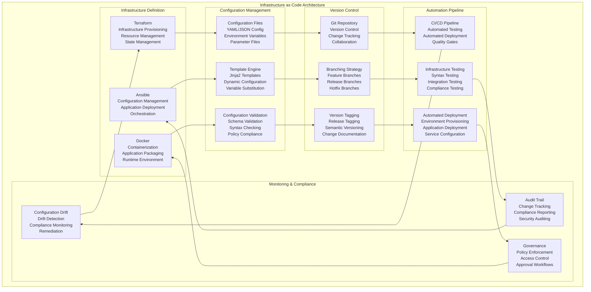

---

## 9. Operational Architecture

### 9.1 Operational Excellence Framework

The operational architecture ensures that the LLM server can be operated efficiently, reliably, and with minimal manual intervention while maintaining high standards of performance and availability.

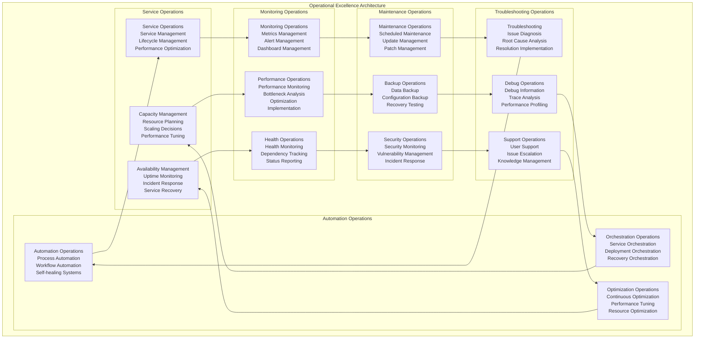

### 9.2 Incident Management Architecture

The incident management architecture provides a structured approach to handling incidents, ensuring rapid detection, response, and resolution while minimizing impact on users and operations.

```mermaid
graph LR
    subgraph "Incident Management Architecture"
        subgraph "Detection & Alerting"
            DETECT[Incident Detection<br/>Automated Monitoring<br/>Threshold Monitoring<br/>Anomaly Detection]
            ALERT[Alert Generation<br/>Alert Rules<br/>Severity Classification<br/>Notification Routing]
            ESCALATE[Alert Escalation<br/>Escalation Policies<br/>On-call Rotation<br/>Escalation Timers]
        end
        
        subgraph "Response & Triage"
            RESPOND[Initial Response<br/>Incident Acknowledgment<br/>Initial Assessment<br/>Response Team Assembly]
            TRIAGE[Incident Triage<br/>Severity Assessment<br/>Impact Analysis<br/>Priority Assignment]
            ASSIGN[Team Assignment<br/>Skill-based Assignment<br/>Workload Distribution<br/>Resource Allocation]
        end
        
        subgraph "Investigation & Resolution"
            INVESTIGATE[Investigation<br/>Root Cause Analysis<br/>Data Collection<br/>Hypothesis Testing]
            DIAGNOSE[Diagnosis<br/>Problem Identification<br/>Impact Assessment<br/>Solution Planning]
            RESOLVE[Resolution<br/>Solution Implementation<br/>Testing & Validation<br/>Service Restoration]
        end
        
        subgraph "Communication & Documentation"
            COMMUNICATE[Communication<br/>Stakeholder Updates<br/>Status Communication<br/>Progress Reporting]
            DOCUMENT[Documentation<br/>Incident Recording<br/>Action Documentation<br/>Timeline Tracking]
            POSTMORTEM[Post-mortem<br/>Incident Analysis<br/>Lessons Learned<br/>Improvement Actions]
        end
        
        subgraph "Recovery & Prevention"
            RECOVER[Recovery<br/>Service Recovery<br/>Data Recovery<br/>Performance Restoration]
            VALIDATE[Validation<br/>Recovery Validation<br/>Performance Testing<br/>Functionality Testing]
            PREVENT[Prevention<br/>Preventive Measures<br/>Process Improvement<br/>System Hardening]
        end
    end
    
    %% Incident Flow
    DETECT --> ALERT
    ALERT --> ESCALATE
    ESCALATE --> RESPOND
    
    RESPOND --> TRIAGE
    TRIAGE --> ASSIGN
    ASSIGN --> INVESTIGATE
    
    INVESTIGATE --> DIAGNOSE
    DIAGNOSE --> RESOLVE
    RESOLVE --> COMMUNICATE
    
    COMMUNICATE --> DOCUMENT
    DOCUMENT --> POSTMORTEM
    POSTMORTEM --> RECOVER
    
    RECOVER --> VALIDATE
    VALIDATE --> PREVENT
    
    %% Feedback Loops
    PREVENT --> DETECT
    POSTMORTEM --> ALERT
    VALIDATE --> ESCALATE
```

---

## 10. Quality Architecture

### 10.1 Quality Assurance Framework

The quality architecture ensures that all components of the LLM server meet the highest standards of reliability, performance, security, and maintainability through comprehensive testing and validation processes.

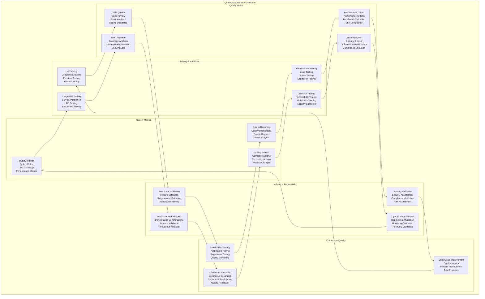

### 10.2 Certification and Compliance Architecture

The certification and compliance architecture ensures that the LLM server meets all required standards, regulations, and organizational policies through systematic validation and documentation processes.

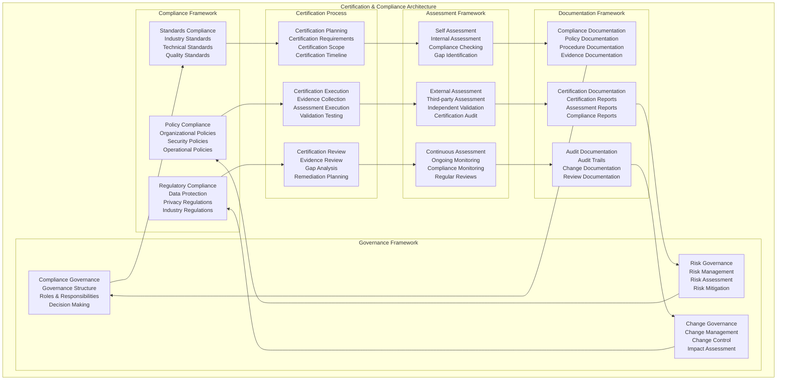

---

## 11. Future Architecture Considerations

### 11.1 Extensibility and Evolution

The architecture is designed with extensibility and evolution in mind, ensuring that the system can accommodate future requirements, technologies, and use cases without requiring fundamental redesign.

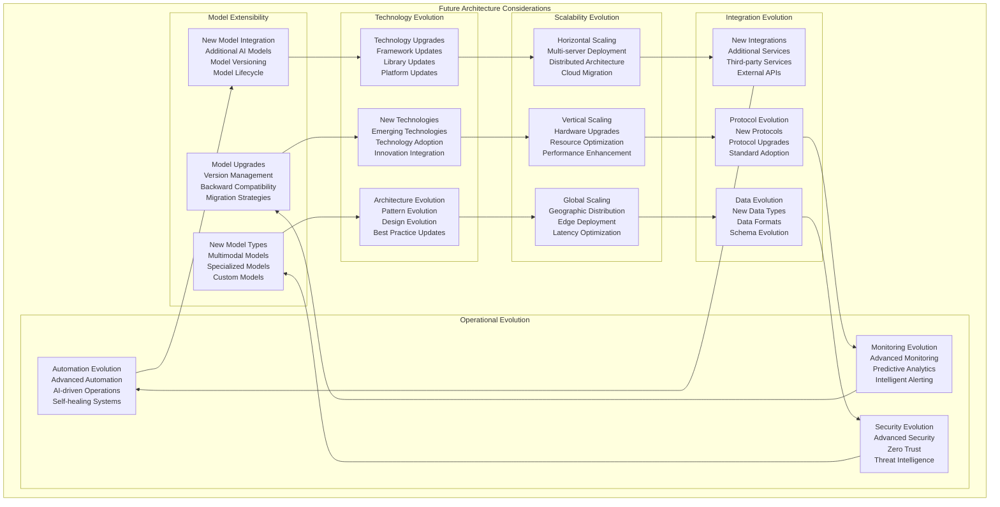

### 11.2 Strategic Architecture Roadmap

The strategic architecture roadmap provides a long-term vision for the evolution of the LLM server architecture, ensuring alignment with organizational objectives and technology trends.

```mermaid
graph LR
    subgraph "Strategic Architecture Roadmap"
        subgraph "Phase 1: Foundation"
            FOUNDATION[Foundation Phase<br/>Core Infrastructure<br/>Basic Integration<br/>Essential Features]
            STABILITY[Stability Phase<br/>Performance Optimization<br/>Reliability Enhancement<br/>Operational Excellence]
            VALIDATION[Validation Phase<br/>Quality Assurance<br/>Compliance Validation<br/>Production Readiness]
        end
        
        subgraph "Phase 2: Enhancement"
            ENHANCEMENT[Enhancement Phase<br/>Advanced Features<br/>Performance Optimization<br/>User Experience]
            INTEGRATION[Integration Phase<br/>Extended Integration<br/>Ecosystem Expansion<br/>Interoperability]
            AUTOMATION[Automation Phase<br/>Process Automation<br/>Intelligent Operations<br/>Self-service Capabilities]
        end
        
        subgraph "Phase 3: Innovation"
            INNOVATION[Innovation Phase<br/>Emerging Technologies<br/>Advanced Capabilities<br/>Competitive Advantage]
            INTELLIGENCE[Intelligence Phase<br/>AI-driven Operations<br/>Predictive Capabilities<br/>Autonomous Systems]
            TRANSFORMATION[Transformation Phase<br/>Digital Transformation<br/>Business Innovation<br/>Strategic Value]
        end
        
        subgraph "Phase 4: Evolution"
            EVOLUTION[Evolution Phase<br/>Continuous Evolution<br/>Adaptive Architecture<br/>Future-ready Systems]
            ECOSYSTEM[Ecosystem Phase<br/>Platform Evolution<br/>Ecosystem Integration<br/>Value Network]
            LEADERSHIP[Leadership Phase<br/>Technology Leadership<br/>Innovation Leadership<br/>Market Leadership]
        end
    end
    
    %% Roadmap Progression
    FOUNDATION --> ENHANCEMENT
    STABILITY --> INTEGRATION
    VALIDATION --> AUTOMATION
    
    ENHANCEMENT --> INNOVATION
    INTEGRATION --> INTELLIGENCE
    AUTOMATION --> TRANSFORMATION
    
    INNOVATION --> EVOLUTION
    INTELLIGENCE --> ECOSYSTEM
    TRANSFORMATION --> LEADERSHIP
    
    %% Strategic Alignment
    FOUNDATION --> STABILITY
    STABILITY --> VALIDATION
    ENHANCEMENT --> INTEGRATION
    INTEGRATION --> AUTOMATION
    INNOVATION --> INTELLIGENCE
    INTELLIGENCE --> TRANSFORMATION
    EVOLUTION --> ECOSYSTEM
    ECOSYSTEM --> LEADERSHIP
```

---

## 12. Conclusion

### 12.1 Architecture Summary

The HX-Enterprise-LLM-Server-01 architecture represents a comprehensive, well-designed system that provides high-performance AI inference capabilities while maintaining seamless integration with the broader Citadel AI Operating System infrastructure. The architecture successfully balances performance, scalability, reliability, and maintainability through its layered design approach and proven integration patterns.

The architecture leverages successful patterns from the Vector Database Server and PostgreSQL Database Server implementations, incorporating lessons learned and best practices to ensure operational excellence. The system is designed with a focus on modularity, enabling future expansion and enhancement while maintaining stability and reliability. The comprehensive monitoring and observability framework ensures complete visibility into all aspects of system operation, enabling proactive issue detection and performance optimization.

### 12.2 Key Architectural Strengths

The architecture demonstrates several key strengths that position it for long-term success. First, the **layered architecture approach** provides clear separation of concerns while enabling efficient communication between components. This design facilitates maintenance, testing, and future enhancements while ensuring system stability. Second, the **proven integration patterns** leverage successful implementations from existing infrastructure components, reducing risk and ensuring reliable connectivity to external services.

Third, the **comprehensive monitoring and observability** framework provides complete visibility into all aspects of system operation, enabling proactive management and continuous optimization. Fourth, the **scalable design** ensures that the system can accommodate future growth, additional models, and increased workloads without requiring fundamental architectural changes. Finally, the **quality assurance framework** ensures that all components meet the highest standards of reliability, performance, and security through comprehensive testing and validation processes.

### 12.3 Implementation Readiness

This architecture document provides comprehensive technical specifications for implementing the HX-Enterprise-LLM-Server-01 with complete confidence in its design and approach. The architecture is built upon proven patterns, incorporates industry best practices, and addresses all aspects of system design from performance and scalability to security and operational excellence.

The detailed component specifications, integration patterns, and operational procedures provide clear guidance for implementation teams, ensuring consistent and successful deployment. The comprehensive monitoring and quality assurance frameworks ensure that the implemented system will meet all performance, reliability, and operational requirements while providing the foundation for future growth and enhancement.

### 12.4 Strategic Value

The HX-Enterprise-LLM-Server-01 architecture delivers significant strategic value to the organization through its comprehensive design and implementation approach. The system provides essential AI inference capabilities that enable innovative research and development initiatives while maintaining seamless integration with existing infrastructure. The scalable and extensible design ensures that the investment in this architecture will continue to deliver value as requirements evolve and new opportunities emerge.

The architecture positions the organization for success in the rapidly evolving AI landscape by providing a robust, reliable, and high-performance platform for AI inference operations. The comprehensive operational framework ensures that the system can be managed efficiently and effectively, minimizing operational overhead while maximizing system availability and performance. This architecture serves as a cornerstone for the broader Citadel AI Operating System, enabling the organization to achieve its strategic objectives in AI research and development.

