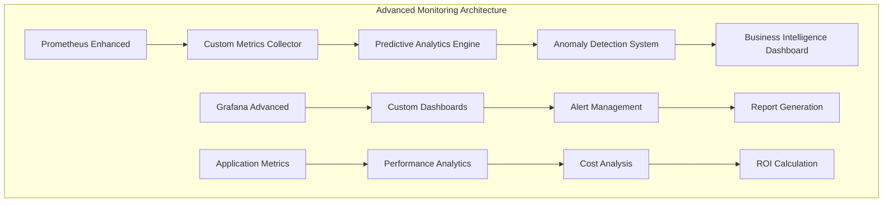
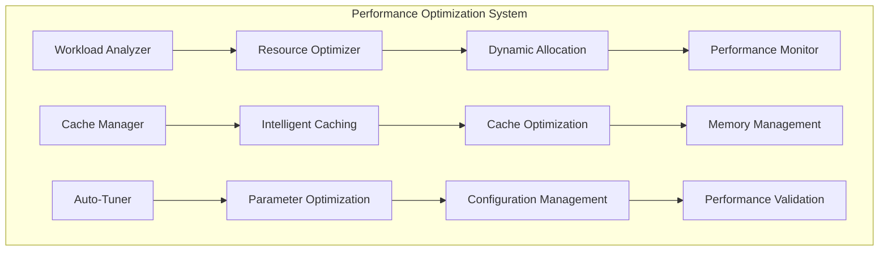
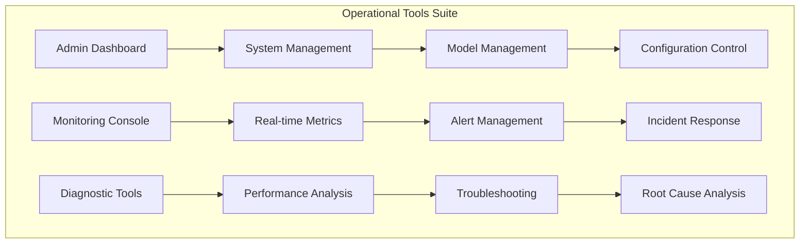

# MVP 2: Advanced Features - HX-Enterprise-LLM-Server-01

**Document Version:** 1.0  
**Date:** 2025-01-19  
**Author:** Manus AI  
**Project:** HX-Enterprise-LLM-Server-01 (192.168.10.29)  
**MVP Phase:** 2 - Advanced Features and Operational Excellence  

## Executive Summary

MVP 2 represents the advanced features phase of the HX-Enterprise-LLM-Server-01 implementation, building upon the solid foundation established in MVP 1. This phase transforms the basic AI inference capabilities into a sophisticated, enterprise-grade system with advanced monitoring, performance optimization, operational tooling, and enhanced runtime features. The focus shifts from basic functionality to operational excellence, providing comprehensive observability, intelligent performance management, and advanced API capabilities that position the system for production-ready deployment.

The advanced features phase introduces sophisticated monitoring capabilities that extend far beyond basic health checks, implementing predictive analytics, anomaly detection, and business intelligence dashboards. Performance optimization becomes a central focus, with intelligent caching strategies, dynamic resource allocation, and automated performance tuning that ensures optimal system performance under varying workloads. Operational tooling provides comprehensive management capabilities, enabling efficient administration, troubleshooting, and maintenance of the AI inference infrastructure.

This MVP phase establishes the operational excellence framework that distinguishes a basic AI inference system from an enterprise-grade platform. The advanced features implemented in this phase provide the observability, performance, and operational capabilities necessary for supporting mission-critical AI workloads while maintaining the reliability, scalability, and efficiency required for production environments.

## Feature Overview

### Advanced Monitoring and Observability

The advanced monitoring system represents a comprehensive evolution from basic health monitoring to sophisticated observability that provides deep insights into system behavior, performance patterns, and business impact. This monitoring framework implements multiple layers of observability, from low-level system metrics to high-level business intelligence, creating a complete picture of system health and performance.

The monitoring architecture incorporates predictive analytics capabilities that analyze historical performance data to identify trends, predict potential issues, and recommend proactive interventions. Machine learning algorithms continuously analyze system behavior patterns, learning normal operational characteristics and detecting anomalies that may indicate emerging problems or optimization opportunities. This predictive approach enables proactive system management, preventing issues before they impact users and optimizing performance based on anticipated workload patterns.

Business intelligence integration provides stakeholders with comprehensive visibility into the business impact of AI operations, tracking metrics such as cost per inference, user satisfaction scores, and business value generation. These metrics enable data-driven decision making regarding resource allocation, capacity planning, and system optimization priorities. The monitoring system generates automated reports and dashboards that provide both technical teams and business stakeholders with the information needed to understand system performance and business impact.

### Performance Optimization and Tuning

Performance optimization in MVP 2 introduces intelligent, automated systems that continuously monitor and optimize system performance across multiple dimensions. The optimization framework implements dynamic resource allocation algorithms that automatically adjust CPU, memory, and GPU resources based on real-time workload demands and performance requirements. This dynamic allocation ensures optimal resource utilization while maintaining performance targets across all AI models.

Intelligent caching strategies form a critical component of the performance optimization framework, implementing multi-tier caching that optimizes both inference speed and resource utilization. The caching system analyzes request patterns, model usage statistics, and performance characteristics to implement optimal caching strategies for different types of workloads. Advanced cache management algorithms ensure that frequently accessed models and data remain readily available while efficiently managing memory resources.

Automated performance tuning capabilities continuously analyze system performance metrics and automatically adjust configuration parameters to optimize performance. The tuning system implements machine learning algorithms that learn optimal configuration settings for different workload patterns, automatically adjusting parameters such as batch sizes, concurrency levels, and resource allocation to maintain optimal performance as workload characteristics change.

### Operational Tooling and Management

The operational tooling framework provides comprehensive management capabilities that enable efficient administration, monitoring, and maintenance of the AI inference infrastructure. This tooling includes sophisticated dashboard interfaces that provide real-time visibility into system status, performance metrics, and operational health across all system components.

Administrative interfaces enable efficient management of AI models, including deployment, configuration, and lifecycle management capabilities. The tooling provides comprehensive model management features, including version control, rollback capabilities, and A/B testing frameworks that enable safe deployment and testing of model updates. Configuration management tools ensure consistent configuration across all system components while providing audit trails and rollback capabilities for configuration changes.

Troubleshooting and diagnostic tools provide comprehensive capabilities for identifying, analyzing, and resolving system issues. The diagnostic framework includes automated issue detection, root cause analysis capabilities, and guided troubleshooting workflows that enable rapid resolution of operational issues. Performance analysis tools provide detailed insights into system behavior, enabling optimization and capacity planning activities.

### Enhanced API Capabilities

The enhanced API framework extends the basic inference APIs with sophisticated features that support advanced use cases and integration patterns. Multi-protocol support includes REST, GraphQL, and gRPC interfaces, each optimized for different types of client applications and integration scenarios. The API gateway implements intelligent routing capabilities that automatically direct requests to optimal model instances based on current load, performance characteristics, and client requirements.

Advanced authentication and authorization capabilities provide fine-grained access control, supporting multiple authentication methods and role-based access control that enables secure multi-tenant usage. Rate limiting and quota management features ensure fair resource allocation and prevent abuse while supporting different service levels for different user categories.

API versioning and compatibility management ensure smooth evolution of API capabilities while maintaining backward compatibility for existing clients. The API framework includes comprehensive documentation generation, testing tools, and client SDK generation capabilities that simplify integration and development activities.

## Detailed Feature Specifications

### Monitoring Infrastructure Enhancement

The monitoring infrastructure enhancement implements a sophisticated observability platform that provides comprehensive insights into system behavior, performance, and business impact. The enhanced Prometheus configuration includes custom metrics collectors that gather detailed performance data from all system components, including AI model inference metrics, resource utilization statistics, and business-relevant measurements.

The predictive analytics engine analyzes historical performance data using machine learning algorithms to identify trends, predict future performance characteristics, and recommend optimization strategies. This engine implements time series analysis, regression modeling, and pattern recognition algorithms that enable proactive system management and capacity planning. The analytics engine continuously learns from system behavior, improving prediction accuracy and optimization recommendations over time.

Anomaly detection systems monitor system behavior in real-time, comparing current performance against learned baseline patterns to identify unusual behavior that may indicate problems or optimization opportunities. The detection system implements multiple algorithms, including statistical analysis, machine learning-based detection, and rule-based monitoring, providing comprehensive coverage of potential anomalies.

Business intelligence dashboards provide stakeholders with comprehensive visibility into the business impact of AI operations. These dashboards track metrics such as inference costs, user satisfaction scores, business value generation, and return on investment calculations. The dashboards enable data-driven decision making regarding resource allocation, capacity planning, and system optimization priorities.

### Advanced Dashboard Specifications

The Advanced Dashboard Specifications establish comprehensive requirements for sophisticated monitoring dashboards that provide real-time visibility into system performance, health, operational excellence, and business impact. These specifications align with the Architecture document requirements and ensure comprehensive observability across all advanced system components.

#### Advanced Model Performance Dashboard
- **Real-time Response Times:** Live monitoring with predictive trend analysis
- **Throughput Monitoring:** Advanced request per second metrics with load prediction
- **Error Rate Tracking:** Intelligent error pattern analysis and prediction
- **Resource Utilization:** Dynamic resource allocation and optimization metrics
- **Health Status:** Predictive health indicators with automated recommendations
- **Performance Trends:** Historical analysis with predictive modeling

#### Advanced Resource Utilization Dashboard
- **System Resources:** Intelligent CPU, memory, disk I/O, and network optimization
- **Model-specific Resources:** Dynamic resource allocation and scaling metrics
- **Storage Performance:** Advanced NVMe SSD performance with predictive analysis
- **Network Performance:** Intelligent bandwidth optimization and latency prediction
- **Resource Trends:** Predictive resource usage patterns and capacity planning
- **Optimization Recommendations:** Automated resource optimization suggestions

#### Advanced Integration Health Dashboard
- **Database Connectivity:** Intelligent connection pooling and performance optimization
- **External Service Status:** Predictive service health monitoring and failover
- **API Gateway Health:** Advanced routing performance and load balancing
- **Integration Performance:** Intelligent response time optimization and caching
- **Dependency Mapping:** Advanced service dependency analysis and impact assessment
- **Predictive Maintenance:** Automated maintenance scheduling and optimization

#### Advanced Business Intelligence Dashboard
- **User Satisfaction:** Advanced sentiment analysis and satisfaction prediction
- **Cost Tracking:** Intelligent cost optimization and ROI analysis
- **Usage Patterns:** Predictive usage analysis and capacity planning
- **Performance KPIs:** Advanced SLA compliance and performance optimization
- **Operational Efficiency:** Intelligent efficiency metrics and optimization
- **Business Impact:** Comprehensive ROI analysis and value demonstration

### Performance Optimization Framework

### Performance Benchmarks and Targets

The Performance Benchmarks and Targets establish specific, measurable performance objectives that align with the Architecture document specifications and ensure MVP 2 meets advanced operational requirements while providing the foundation for production readiness in MVP 3.

#### Advanced Performance Benchmarks
- **Mixtral-8x7B:** Target latency <1500ms, throughput 10 req/sec, optimized caching
- **Hermes-2:** Target latency <1000ms, throughput 20 req/sec, conversational optimization
- **OpenChat-3.5:** Target latency <800ms, throughput 25 req/sec, general-purpose optimization
- **Phi-3-Mini:** Target latency <300ms, throughput 50 req/sec, lightweight optimization
- **System Overall:** 99.5% uptime, <3 minute MTTR, predictive maintenance

#### Advanced Integration Benchmarks
- **API Gateway:** Response time overhead <30ms, throughput 100 req/sec, intelligent routing
- **SQL Database:** Query response time <50ms, connection pool 200 concurrent, query optimization
- **Vector Database:** Similarity search <150ms, embedding operations <200ms, advanced indexing
- **Metrics Export:** Prometheus scrape interval 10s, custom business metrics, predictive analytics

#### Advanced Resource Utilization Benchmarks
- **Memory Utilization:** <85% of 192GB total system memory with intelligent allocation
- **CPU Utilization:** <80% balanced across allocated cores with dynamic scaling
- **Storage I/O:** Optimized for model loading and inference with intelligent caching
- **Network Utilization:** Efficient external service communication with load balancing

The performance optimization framework implements intelligent, automated systems that continuously monitor and optimize system performance across multiple dimensions. The workload analyzer continuously monitors incoming requests, analyzing patterns, resource requirements, and performance characteristics to understand current and predicted workload demands.

The resource optimizer implements dynamic allocation algorithms that automatically adjust CPU, memory, and GPU resources based on real-time workload analysis and performance requirements. The optimizer considers multiple factors, including current resource utilization, performance targets, cost constraints, and predicted workload patterns, to determine optimal resource allocation strategies.

Intelligent caching systems implement multi-tier caching strategies that optimize both inference speed and resource utilization. The caching system analyzes request patterns, model usage statistics, and performance characteristics to implement optimal caching strategies for different types of workloads. Advanced cache management algorithms ensure efficient memory utilization while maximizing cache hit rates.

Automated tuning capabilities continuously analyze system performance metrics and automatically adjust configuration parameters to optimize performance. The tuning system implements machine learning algorithms that learn optimal configuration settings for different workload patterns, automatically adjusting parameters to maintain optimal performance as conditions change.

### Operational Excellence Tools

The operational excellence tools provide comprehensive management capabilities that enable efficient administration, monitoring, and maintenance of the AI inference infrastructure. The administrative dashboard provides a centralized interface for managing all aspects of the system, including model deployment, configuration management, and system monitoring.

System management tools provide comprehensive capabilities for managing system components, including service lifecycle management, configuration updates, and system health monitoring. The management interface includes automated deployment capabilities, rollback features, and comprehensive audit trails that ensure reliable system operation.

Model management capabilities provide sophisticated tools for managing AI model lifecycles, including deployment, versioning, testing, and rollback capabilities. The model management system includes A/B testing frameworks that enable safe testing of model updates, performance comparison tools, and automated rollback capabilities that ensure system reliability.

Diagnostic and troubleshooting tools provide comprehensive capabilities for identifying, analyzing, and resolving system issues. The diagnostic framework includes automated issue detection, performance analysis tools, and guided troubleshooting workflows that enable rapid resolution of operational issues.

## Integration Enhancements

### Database Integration Optimization

The database integration optimization enhances the basic database connectivity established in MVP 1 with sophisticated features that improve performance, reliability, and scalability. Advanced connection pooling implements intelligent pool management that dynamically adjusts pool sizes based on workload demands and performance characteristics.

Query optimization features analyze database access patterns and automatically optimize queries for improved performance. The optimization system includes query caching, index optimization recommendations, and automated performance tuning that ensures optimal database performance under varying workloads.

Data lifecycle management capabilities provide automated data archiving, cleanup, and optimization features that maintain database performance while managing storage costs. The lifecycle management system implements intelligent data retention policies that balance performance requirements with storage efficiency.

### Vector Database Enhancement

Vector database integration enhancements provide sophisticated capabilities for managing vector operations, including advanced similarity search algorithms, vector indexing optimization, and intelligent caching strategies. The enhanced integration implements multi-dimensional indexing that optimizes search performance for different types of vector operations.

Advanced similarity search capabilities include support for multiple distance metrics, approximate nearest neighbor algorithms, and hybrid search strategies that combine vector similarity with traditional filtering criteria. The search system implements intelligent query optimization that automatically selects optimal search strategies based on query characteristics and performance requirements.

Vector caching strategies implement intelligent caching of frequently accessed vectors and search results, significantly improving query performance while managing memory utilization efficiently. The caching system analyzes access patterns and automatically optimizes cache strategies for different types of vector operations.

### Metrics Server Integration

Enhanced metrics server integration provides sophisticated monitoring and alerting capabilities that extend beyond basic system monitoring to include business intelligence, predictive analytics, and automated optimization recommendations. The integration implements real-time data streaming that provides immediate visibility into system performance and business metrics.

Advanced alerting capabilities include predictive alerting that identifies potential issues before they impact system performance, intelligent alert correlation that reduces alert noise, and automated response capabilities that can automatically resolve common issues. The alerting system implements machine learning algorithms that continuously improve alert accuracy and reduce false positives.

Business intelligence integration provides comprehensive reporting and analytics capabilities that enable data-driven decision making regarding system optimization, capacity planning, and resource allocation. The integration includes automated report generation, trend analysis, and ROI calculation capabilities that provide stakeholders with comprehensive visibility into system performance and business impact.

## Technical Implementation Details

### Advanced Monitoring Configuration

The advanced monitoring configuration implements a comprehensive observability platform that provides detailed insights into system behavior, performance, and business impact. The configuration includes custom Prometheus metrics that capture detailed performance data from all system components, including AI model inference metrics, resource utilization statistics, and business-relevant measurements.

Grafana dashboard configurations provide sophisticated visualization capabilities that enable comprehensive monitoring of system health, performance trends, and business metrics. The dashboards include real-time monitoring views, historical trend analysis, and predictive analytics visualizations that provide stakeholders with comprehensive visibility into system operation.

Alert management configurations implement intelligent alerting strategies that provide timely notification of issues while minimizing alert fatigue. The alerting system includes escalation procedures, automated response capabilities, and comprehensive alert correlation that ensures appropriate response to system issues.

### Performance Optimization Implementation

Performance optimization implementation includes sophisticated algorithms and configurations that automatically optimize system performance across multiple dimensions. Dynamic resource allocation algorithms continuously monitor workload demands and automatically adjust resource allocation to maintain optimal performance while minimizing costs.

Intelligent caching implementations provide multi-tier caching strategies that optimize both inference speed and resource utilization. The caching system includes sophisticated cache management algorithms that ensure optimal cache hit rates while efficiently managing memory resources.

Automated tuning implementations continuously analyze system performance and automatically adjust configuration parameters to optimize performance. The tuning system includes machine learning algorithms that learn optimal configuration settings and automatically apply optimizations based on changing workload characteristics.

### API Enhancement Implementation

API enhancement implementation provides sophisticated features that support advanced use cases and integration patterns. Multi-protocol support includes optimized implementations for REST, GraphQL, and gRPC interfaces, each tailored for different types of client applications and integration scenarios.

Advanced authentication and authorization implementations provide fine-grained access control with support for multiple authentication methods and role-based access control. The security implementation includes comprehensive audit logging, session management, and threat detection capabilities that ensure secure system operation.

API versioning and compatibility management implementations ensure smooth evolution of API capabilities while maintaining backward compatibility for existing clients. The versioning system includes comprehensive testing frameworks, migration tools, and documentation generation capabilities that simplify API evolution and client integration.

## Advanced Security and Compliance Features

### Enhanced Security Framework

The enhanced security framework implements sophisticated security capabilities that extend beyond basic authentication and authorization to include advanced threat detection, comprehensive audit logging, and intelligent security monitoring. This framework provides enterprise-grade security that protects against sophisticated threats while maintaining operational efficiency.

#### Advanced Authentication and Authorization
- **Multi-Factor Authentication:** Support for multiple authentication methods including tokens, certificates, and biometric authentication
- **Role-Based Access Control (RBAC):** Fine-grained access control with dynamic role assignment and permission management
- **Session Management:** Advanced session handling with automatic timeout, concurrent session limits, and session hijacking protection
- **API Security:** Comprehensive API security including rate limiting, input validation, and request sanitization

#### Advanced Threat Detection
- **Anomaly Detection:** Machine learning-based anomaly detection that identifies unusual access patterns and potential security threats
- **Intrusion Detection:** Real-time monitoring of system access and automatic detection of potential security breaches
- **Threat Intelligence:** Integration with threat intelligence feeds to identify and respond to known security threats
- **Automated Response:** Intelligent automated response capabilities that can automatically block suspicious activities

#### Comprehensive Audit and Compliance
- **Audit Logging:** Comprehensive audit trail that captures all security-relevant events with tamper-evident storage
- **Compliance Monitoring:** Automated compliance checking against security policies and regulatory requirements
- **Security Reporting:** Automated security reports and dashboards that provide visibility into security posture
- **Incident Response:** Comprehensive incident response procedures with automated escalation and notification

### Data Protection and Privacy

The data protection and privacy framework implements comprehensive data security measures that ensure sensitive data is properly protected throughout the system lifecycle.

#### Data Encryption
- **Encryption at Rest:** Comprehensive encryption of all stored data using industry-standard encryption algorithms
- **Encryption in Transit:** TLS/SSL encryption for all data transmission with certificate management
- **Key Management:** Sophisticated key management system with automatic key rotation and secure key storage
- **Data Classification:** Automated data classification and appropriate security controls based on data sensitivity

#### Privacy Protection
- **Data Minimization:** Automated data minimization that ensures only necessary data is collected and processed
- **User Consent Management:** Comprehensive user consent management with granular consent controls
- **Data Retention:** Automated data retention policies with secure data deletion and archival procedures
- **Privacy Impact Assessment:** Automated privacy impact assessment and compliance monitoring

## Quality Assurance and Testing

### Performance Testing Framework

The performance testing framework implements comprehensive testing capabilities that validate system performance under various workload conditions. Load testing capabilities simulate realistic workload patterns and measure system performance under different load conditions, ensuring that performance targets are met across all operational scenarios.

Stress testing implementations push system performance to limits, identifying performance bottlenecks and failure points that inform capacity planning and optimization activities. The stress testing framework includes automated test execution, comprehensive performance measurement, and detailed analysis capabilities that provide insights into system behavior under extreme conditions.

Benchmark testing capabilities provide standardized performance measurements that enable comparison with performance targets and historical performance data. The benchmark testing framework includes automated test execution, standardized metrics collection, and comprehensive reporting capabilities that support performance validation and optimization activities.

### Integration Testing Enhancement

Integration testing enhancements provide comprehensive validation of system integration points, ensuring reliable operation across all system components. Database integration testing validates performance, reliability, and data consistency across all database operations, ensuring optimal database performance under various workload conditions.

Vector database integration testing validates vector operations, search performance, and data consistency, ensuring optimal vector database performance for AI inference operations. The testing framework includes comprehensive validation of similarity search accuracy, performance characteristics, and scalability under various workload conditions.

API integration testing validates all API endpoints, authentication mechanisms, and integration patterns, ensuring reliable operation for all client applications and integration scenarios. The testing framework includes comprehensive validation of API performance, security, and compatibility across all supported protocols and client types.

### Security Validation

Security validation implementations provide comprehensive security testing and validation capabilities that ensure system security across all operational scenarios. Authentication and authorization testing validates access control mechanisms, ensuring that security policies are properly implemented and enforced.

Data security testing validates data protection mechanisms, including encryption, access controls, and audit logging, ensuring that sensitive data is properly protected throughout the system. The security testing framework includes comprehensive validation of data handling procedures, security configurations, and compliance requirements.

Network security testing validates network security configurations, including firewall rules, network segmentation, and communication security, ensuring that network-based attacks are properly prevented and detected. The security testing framework includes comprehensive validation of network security policies and configurations.

## Success Metrics and KPIs

### Performance Metrics

Performance metrics provide comprehensive measurement of system performance across all operational dimensions. Response time metrics measure the time required to process inference requests, with targets of less than 1500ms for Mixtral-8x7B, less than 1000ms for Hermes-2, less than 800ms for OpenChat-3.5, and less than 300ms for Phi-3-Mini under normal load conditions.

Throughput metrics measure the number of inference requests processed per unit time, with targets of at least 10 requests per second for Mixtral-8x7B, 20 requests per second for Hermes-2, 25 requests per second for OpenChat-3.5, and 50 requests per second for Phi-3-Mini under normal load conditions.

Resource utilization metrics measure the efficiency of resource usage, including CPU utilization targets of less than 80% under normal load, memory utilization targets of less than 85% of allocated memory, and GPU utilization targets of less than 90% under normal load conditions.

### Operational Metrics

Operational metrics provide comprehensive measurement of system reliability and operational excellence. System availability metrics target 99.5% uptime during business hours, with comprehensive monitoring of all system components and automated failover capabilities that minimize service disruptions.

Error rate metrics target less than 0.1% error rate for all inference operations, with comprehensive error tracking, analysis, and resolution capabilities that ensure high system reliability. The error tracking system includes automated error detection, classification, and escalation procedures that ensure rapid resolution of issues.

Recovery time metrics target recovery from failures within 5 minutes for automated recovery and within 15 minutes for manual intervention scenarios. The recovery framework includes comprehensive backup and restore capabilities, automated failover procedures, and detailed recovery documentation that ensures rapid system restoration.

### Business Metrics

Business metrics provide comprehensive measurement of business value and return on investment. Cost efficiency metrics track the cost per inference operation, with targets of optimizing costs while maintaining performance and quality requirements. The cost tracking system includes comprehensive resource utilization analysis and optimization recommendations.

User satisfaction metrics track user experience and satisfaction with system performance, with targets of maintaining high user satisfaction scores through reliable performance and comprehensive support capabilities. The satisfaction tracking system includes user feedback collection, analysis, and improvement recommendation capabilities.

Business value metrics track the business impact of AI operations, including productivity improvements, cost savings, and revenue generation enabled by AI capabilities. The business value tracking system includes comprehensive ROI analysis and business impact measurement capabilities that demonstrate the value of AI investments.

## Risk Management and Mitigation

### Technical Risks

Technical risks include potential performance degradation under high load conditions, which is mitigated through comprehensive performance testing, automated scaling capabilities, and proactive monitoring that identifies and addresses performance issues before they impact users. The risk mitigation strategy includes detailed capacity planning, performance optimization procedures, and emergency response protocols.

Integration complexity risks are mitigated through comprehensive integration testing, standardized integration patterns, and detailed documentation that ensures reliable integration with all system components. The integration risk mitigation strategy includes comprehensive testing frameworks, rollback procedures, and detailed troubleshooting documentation.

Technology evolution risks are mitigated through modular architecture design, standardized interfaces, and comprehensive upgrade procedures that enable smooth evolution of system capabilities. The technology risk mitigation strategy includes regular technology assessments, upgrade planning, and compatibility testing procedures.

### Operational Risks

Operational risks include potential system failures that could impact service availability, which are mitigated through comprehensive monitoring, automated failover capabilities, and detailed recovery procedures. The operational risk mitigation strategy includes redundancy planning, backup procedures, and comprehensive disaster recovery capabilities.

Security risks are mitigated through comprehensive security testing, regular security assessments, and detailed security procedures that ensure system security across all operational scenarios. The security risk mitigation strategy includes threat detection capabilities, incident response procedures, and comprehensive security training.

Capacity risks are mitigated through comprehensive capacity planning, automated scaling capabilities, and proactive monitoring that ensures adequate system capacity for current and projected workloads. The capacity risk mitigation strategy includes detailed capacity analysis, scaling procedures, and resource optimization capabilities.

### Business Risks

Business risks include potential cost overruns that could impact project viability, which are mitigated through comprehensive cost tracking, budget monitoring, and cost optimization procedures that ensure efficient resource utilization. The cost risk mitigation strategy includes detailed cost analysis, optimization recommendations, and budget management procedures.

Timeline risks are mitigated through detailed project planning, comprehensive task management, and proactive issue identification that ensures timely project completion. The timeline risk mitigation strategy includes detailed project tracking, resource allocation optimization, and contingency planning procedures.

Quality risks are mitigated through comprehensive testing frameworks, quality assurance procedures, and continuous improvement processes that ensure high system quality and reliability. The quality risk mitigation strategy includes detailed quality metrics, testing procedures, and improvement recommendation capabilities.

## Conclusion

MVP 2 represents a significant evolution from basic AI inference capabilities to sophisticated, enterprise-grade operational excellence. The advanced features implemented in this phase provide comprehensive monitoring, performance optimization, operational tooling, and enhanced API capabilities that position the system for production-ready deployment.

The comprehensive monitoring and observability capabilities provide stakeholders with detailed insights into system behavior, performance trends, and business impact, enabling data-driven decision making and proactive system management. Performance optimization features ensure optimal system performance under varying workload conditions while minimizing resource costs and maximizing efficiency.

Operational excellence tools provide comprehensive management capabilities that enable efficient administration, troubleshooting, and maintenance of the AI inference infrastructure. Enhanced API capabilities support advanced use cases and integration patterns that enable sophisticated client applications and integration scenarios.

The success of MVP 2 establishes the foundation for MVP 3, which will focus on comprehensive quality assurance, security validation, and production readiness assessment. The advanced features implemented in MVP 2 provide the operational excellence framework necessary for supporting mission-critical AI workloads while maintaining the reliability, scalability, and efficiency required for production environments.

