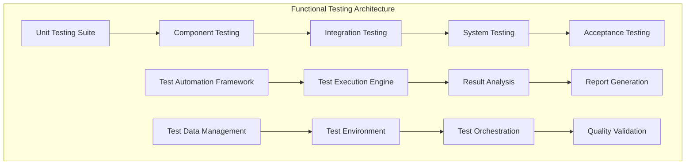
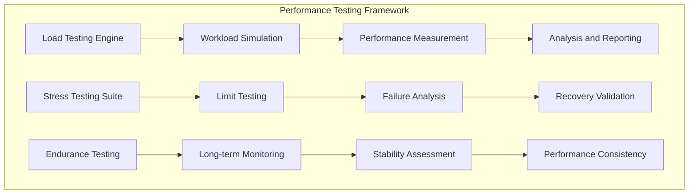
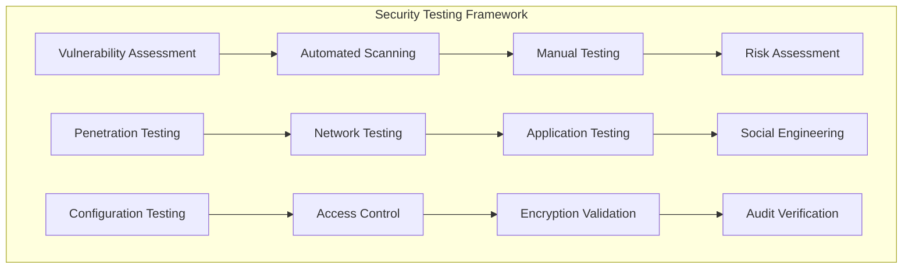

# MVP 3: Quality Assurance - HX-Enterprise-LLM-Server-01

**Document Version:** 1.0  
**Date:** 2025-01-19  
**Author:** Manus AI  
**Project:** HX-Enterprise-LLM-Server-01 (192.168.10.29)  
**MVP Phase:** 3 - Quality Assurance and Production Readiness  

## Executive Summary

MVP 3 represents the culmination of the HX-Enterprise-LLM-Server-01 implementation, focusing on comprehensive quality assurance, security validation, and production readiness assessment. This phase transforms the advanced AI inference system developed in MVP 1 and MVP 2 into a production-ready platform that meets enterprise-grade quality, security, and compliance standards. The quality assurance phase implements rigorous testing frameworks, comprehensive security validation, and detailed certification processes that ensure the system meets the highest standards of reliability, performance, and operational excellence.

The quality assurance framework encompasses multiple dimensions of system validation, including functional testing that verifies all system capabilities operate correctly, performance testing that validates system performance under various load conditions, security testing that ensures comprehensive protection against threats, and compliance testing that verifies adherence to relevant standards and regulations. This comprehensive testing approach ensures that the system is thoroughly validated across all operational scenarios and ready for production deployment.

Security validation forms a critical component of MVP 3, implementing comprehensive security testing, vulnerability assessment, and compliance validation that ensures the system meets enterprise security requirements. The security framework includes penetration testing, security configuration validation, data protection verification, and comprehensive audit capabilities that provide stakeholders with confidence in the system's security posture.

Production readiness assessment provides comprehensive evaluation of the system's readiness for production deployment, including operational procedures validation, documentation completeness verification, and performance benchmark validation. This assessment ensures that all necessary components, procedures, and documentation are in place to support successful production deployment and ongoing operational excellence.

## Quality Assurance Framework

### Comprehensive Testing Strategy

The comprehensive testing strategy implements a multi-layered approach to quality validation that ensures thorough coverage of all system components, integration points, and operational scenarios. This strategy encompasses unit testing that validates individual component functionality, integration testing that verifies component interactions, system testing that validates end-to-end functionality, and acceptance testing that confirms the system meets business requirements.

The testing framework implements automated testing capabilities that enable continuous validation of system quality throughout the development and deployment process. Automated test suites provide comprehensive coverage of functional requirements, performance characteristics, and security configurations, enabling rapid identification and resolution of quality issues. The automation framework includes test execution scheduling, result reporting, and issue tracking capabilities that ensure systematic quality validation.

Test coverage analysis provides detailed measurement of testing completeness, ensuring that all system components, code paths, and operational scenarios are thoroughly tested. The coverage analysis includes code coverage measurement, functional coverage assessment, and scenario coverage validation that provides stakeholders with comprehensive visibility into testing completeness. Coverage targets of greater than 95% ensure thorough validation of all system components.

Quality metrics collection and analysis provide continuous monitoring of system quality characteristics, enabling proactive identification of quality trends and potential issues. The metrics framework tracks defect rates, test pass rates, performance characteristics, and user satisfaction scores, providing comprehensive visibility into system quality. Trend analysis capabilities enable identification of quality patterns and proactive quality improvement initiatives.

### Testing Methodology and Procedures

The testing methodology implements systematic procedures that ensure consistent, thorough, and efficient testing across all system components and operational scenarios. The methodology includes detailed test planning procedures that define testing scope, objectives, and success criteria for each testing phase. Test case development procedures ensure comprehensive coverage of functional requirements, performance characteristics, and security configurations.

Test execution procedures provide systematic approaches to test execution that ensure consistent results and comprehensive documentation of testing activities. The procedures include test environment setup, test data management, test execution monitoring, and result documentation that ensure reliable and repeatable testing processes. Quality gates are implemented at each testing phase to ensure that quality standards are met before proceeding to subsequent phases.

Defect management procedures provide systematic approaches to defect identification, classification, tracking, and resolution. The defect management framework includes automated defect detection, severity classification, assignment procedures, and resolution tracking that ensure rapid and effective resolution of quality issues. Root cause analysis procedures enable identification of underlying causes of defects and implementation of preventive measures.

Test reporting and documentation procedures ensure comprehensive documentation of testing activities, results, and quality assessments. The reporting framework includes automated report generation, trend analysis, and stakeholder communication that provide comprehensive visibility into testing progress and quality status. Documentation standards ensure that all testing activities are thoroughly documented for audit and compliance purposes.

### Quality Gates and Validation Criteria

Quality gates implement systematic checkpoints throughout the development and deployment process that ensure quality standards are met before proceeding to subsequent phases. Each quality gate includes specific validation criteria that must be satisfied, including functional requirements validation, performance benchmark achievement, security configuration verification, and documentation completeness assessment.

The quality gate framework implements automated validation capabilities that enable efficient and consistent quality assessment. Automated validation tools verify that all quality criteria are met, including test pass rates, performance benchmarks, security configurations, and documentation standards. The automation framework provides immediate feedback on quality status and identifies any issues that must be addressed before proceeding.

Validation criteria are defined for each system component and operational scenario, ensuring comprehensive coverage of all quality requirements. The criteria include functional correctness validation, performance characteristic verification, security configuration assessment, and operational procedure validation. Success thresholds are defined for each criterion, providing clear and measurable quality standards.

Quality gate reporting provides comprehensive documentation of quality gate assessments, including validation results, identified issues, and resolution status. The reporting framework enables stakeholders to understand quality status and make informed decisions regarding system readiness for subsequent phases or production deployment.

## Security Validation and Compliance

### Comprehensive Security Testing

Comprehensive security testing implements systematic validation of all security controls, configurations, and procedures to ensure the system provides adequate protection against security threats. The security testing framework includes vulnerability assessment, penetration testing, security configuration validation, and compliance verification that provide comprehensive evaluation of system security posture.

Vulnerability assessment procedures implement systematic identification and evaluation of potential security vulnerabilities across all system components. The assessment includes automated vulnerability scanning, manual security review, and configuration analysis that identify potential security weaknesses. Vulnerability classification and prioritization procedures ensure that security issues are addressed based on risk level and potential impact.

Penetration testing procedures implement systematic attempts to exploit potential security vulnerabilities to validate the effectiveness of security controls. The penetration testing framework includes network security testing, application security testing, and social engineering assessment that provide comprehensive evaluation of security defenses. Testing procedures follow industry-standard methodologies and include comprehensive documentation of testing activities and results.

Security configuration validation procedures verify that all security configurations are properly implemented and maintained according to security standards and best practices. The validation includes access control verification, encryption configuration assessment, audit logging validation, and security policy compliance verification. Automated validation tools enable efficient and consistent security configuration assessment.

### Data Protection and Privacy Validation

Data protection validation implements comprehensive verification of data handling procedures, encryption implementations, and privacy controls to ensure that sensitive data is properly protected throughout the system. The validation framework includes data classification verification, encryption validation, access control assessment, and data lifecycle management verification.

Encryption validation procedures verify that all sensitive data is properly encrypted both in transit and at rest, using appropriate encryption algorithms and key management procedures. The validation includes encryption configuration assessment, key management verification, and encryption performance validation that ensure effective data protection without compromising system performance.

Access control validation procedures verify that access to sensitive data is properly controlled and monitored according to security policies and regulatory requirements. The validation includes authentication mechanism verification, authorization policy assessment, and access logging validation that ensure appropriate access control implementation.

Data lifecycle management validation procedures verify that data retention, archiving, and disposal procedures are properly implemented according to regulatory requirements and organizational policies. The validation includes data retention policy verification, archiving procedure assessment, and secure disposal validation that ensure appropriate data lifecycle management.

### Compliance and Audit Readiness

Compliance validation procedures implement systematic verification that the system meets all applicable regulatory requirements, industry standards, and organizational policies. The compliance framework includes regulatory requirement assessment, standard compliance verification, and policy adherence validation that ensure comprehensive compliance coverage.

Audit readiness procedures ensure that all necessary documentation, procedures, and evidence are in place to support compliance audits and regulatory assessments. The audit readiness framework includes documentation completeness verification, procedure validation, and evidence collection that enable efficient and successful audit processes.

Compliance monitoring procedures implement ongoing verification of compliance status, including automated compliance checking, regular compliance assessments, and compliance reporting that ensure continued adherence to regulatory requirements and organizational policies. The monitoring framework provides early identification of compliance issues and enables proactive remediation.

Compliance reporting procedures provide comprehensive documentation of compliance status, including compliance assessment results, identified issues, and remediation activities. The reporting framework enables stakeholders to understand compliance posture and make informed decisions regarding compliance management and risk mitigation.

## Performance Validation and Benchmarking

### Comprehensive Performance Testing

Comprehensive performance testing implements systematic validation of system performance characteristics under various load conditions and operational scenarios. The performance testing framework includes load testing, stress testing, endurance testing, and scalability testing that provide comprehensive evaluation of system performance capabilities.

Load testing procedures implement systematic validation of system performance under expected operational loads, measuring response times, throughput, resource utilization, and error rates under normal operating conditions. The load testing framework includes realistic workload simulation, performance measurement, and analysis capabilities that provide comprehensive understanding of system performance characteristics.

Stress testing procedures implement systematic validation of system behavior under extreme load conditions, identifying performance limits, failure points, and recovery characteristics. The stress testing framework includes gradual load increase, failure point identification, and recovery validation that provide understanding of system behavior under stress conditions.

Endurance testing procedures implement long-duration testing that validates system stability and performance consistency over extended periods. The endurance testing framework includes extended load application, performance monitoring, and stability assessment that ensure the system maintains consistent performance over time.

Scalability testing procedures implement validation of system scaling capabilities, including horizontal scaling, vertical scaling, and performance scaling under increasing load conditions. The scalability testing framework includes scaling scenario testing, performance measurement, and scaling efficiency assessment that validate the system's ability to handle growing workloads.

### Performance Benchmark Validation

Performance benchmark validation implements systematic comparison of system performance against established performance targets and industry benchmarks. The benchmark validation framework includes performance target verification, industry benchmark comparison, and competitive analysis that provide comprehensive evaluation of system performance competitiveness.

Performance target validation procedures verify that the system meets all established performance requirements, including response time targets, throughput requirements, resource utilization limits, and availability targets. The validation includes systematic measurement of performance characteristics and comparison against established targets.

Industry benchmark comparison procedures implement comparison of system performance against industry-standard benchmarks and competitive systems. The comparison framework includes benchmark test execution, performance measurement, and competitive analysis that provide understanding of system performance relative to industry standards.

Performance optimization validation procedures verify that all performance optimization features operate correctly and provide expected performance improvements. The validation includes optimization feature testing, performance improvement measurement, and optimization effectiveness assessment that ensure optimal system performance.

Performance monitoring validation procedures verify that all performance monitoring capabilities operate correctly and provide accurate performance measurement and reporting. The validation includes monitoring system testing, metric accuracy verification, and reporting validation that ensure reliable performance monitoring capabilities.

## Certification and Documentation

### Comprehensive Certification Process

The comprehensive certification process implements systematic validation and approval procedures that ensure the system meets all quality, security, and operational requirements for production deployment. The certification framework includes technical certification, security certification, operational certification, and business certification that provide comprehensive validation of system readiness.

Technical certification procedures implement systematic validation of all technical requirements, including functional requirements verification, performance requirement validation, integration requirement assessment, and technical documentation completeness verification. The technical certification process ensures that all technical aspects of the system are properly implemented and validated.

Security certification procedures implement comprehensive validation of security requirements, including security control verification, vulnerability assessment completion, compliance validation, and security documentation completeness verification. The security certification process ensures that the system meets all security requirements and is ready for secure operation.

Operational certification procedures implement validation of operational readiness, including operational procedure verification, monitoring system validation, maintenance procedure assessment, and operational documentation completeness verification. The operational certification process ensures that all necessary operational capabilities are in place for successful system operation.

Business certification procedures implement validation of business requirements, including business requirement verification, user acceptance testing completion, business process integration validation, and business documentation completeness verification. The business certification process ensures that the system meets all business requirements and is ready for business use.

### Documentation Completeness and Quality

Documentation completeness validation implements systematic verification that all necessary documentation is complete, accurate, and up-to-date. The documentation validation framework includes technical documentation assessment, operational documentation verification, user documentation evaluation, and compliance documentation validation.

Technical documentation validation procedures verify that all technical documentation is complete, accurate, and provides sufficient detail for system understanding, maintenance, and troubleshooting. The validation includes architecture documentation assessment, configuration documentation verification, and troubleshooting guide evaluation.

Operational documentation validation procedures verify that all operational procedures are documented, tested, and provide sufficient detail for effective system operation. The validation includes deployment procedure verification, monitoring procedure assessment, and maintenance procedure evaluation.

User documentation validation procedures verify that all user-facing documentation is complete, accurate, and provides sufficient guidance for effective system use. The validation includes user guide assessment, API documentation verification, and training material evaluation.

Compliance documentation validation procedures verify that all compliance-related documentation is complete, accurate, and provides sufficient evidence for compliance verification. The validation includes compliance policy documentation, audit trail verification, and regulatory requirement documentation assessment.

## Detailed Testing Specifications

### Functional Testing Framework

The functional testing framework implements comprehensive validation of all system functionality across multiple testing levels. Unit testing validates individual component functionality, ensuring that each software module operates correctly in isolation. The unit testing suite includes comprehensive test coverage of all functions, methods, and classes, with automated test execution and result reporting capabilities.

Component testing validates the functionality of integrated components, ensuring that component interactions operate correctly and produce expected results. The component testing framework includes interface testing, data flow validation, and error handling verification that ensure reliable component operation.

Integration testing validates the functionality of integrated system components, ensuring that all integration points operate correctly and produce expected results. The integration testing framework includes database integration testing, API integration validation, and external service integration verification that ensure reliable system integration.

System testing validates end-to-end system functionality, ensuring that all system capabilities operate correctly under realistic operational conditions. The system testing framework includes workflow testing, performance validation, and user scenario testing that ensure comprehensive system functionality validation.

Acceptance testing validates that the system meets business requirements and user expectations, ensuring that all business functionality operates correctly and provides expected value. The acceptance testing framework includes user acceptance testing, business process validation, and stakeholder approval procedures that ensure business requirement satisfaction.

### Performance Testing Implementation

The performance testing implementation provides comprehensive validation of system performance characteristics under various operational conditions. Load testing simulates realistic user workloads and measures system performance under normal operating conditions, including response time measurement, throughput analysis, and resource utilization monitoring.

The load testing framework implements sophisticated workload simulation capabilities that accurately represent expected user behavior patterns and system usage scenarios. Workload simulation includes realistic request patterns, data volumes, and user interaction scenarios that provide accurate performance measurement under expected operational conditions.

Stress testing pushes system performance to limits, identifying performance bottlenecks, failure points, and system behavior under extreme conditions. The stress testing framework includes gradual load increase, performance degradation monitoring, and failure point identification that provide understanding of system performance limits and failure characteristics.

Endurance testing validates system performance consistency over extended periods, ensuring that the system maintains stable performance characteristics during long-term operation. The endurance testing framework includes extended load application, performance monitoring, and stability assessment that validate long-term system reliability.

Performance measurement capabilities provide comprehensive collection and analysis of performance metrics, including response times, throughput rates, resource utilization, and error rates. The measurement framework includes real-time monitoring, historical trend analysis, and performance comparison capabilities that enable comprehensive performance evaluation.

### Security Testing Implementation

The security testing implementation provides comprehensive validation of system security controls and configurations. Vulnerability assessment procedures implement systematic identification and evaluation of potential security vulnerabilities across all system components, including automated vulnerability scanning and manual security review.

Automated vulnerability scanning implements comprehensive scanning of system components, network configurations, and application code to identify potential security vulnerabilities. The scanning framework includes network vulnerability scanning, application security scanning, and configuration assessment that provide comprehensive vulnerability identification.

Manual security testing implements detailed security review and testing procedures that complement automated scanning capabilities. Manual testing includes code review, configuration analysis, and security procedure validation that provide comprehensive security assessment beyond automated capabilities.

Penetration testing implements systematic attempts to exploit identified vulnerabilities and validate the effectiveness of security controls. The penetration testing framework includes network penetration testing, application penetration testing, and social engineering assessment that provide realistic security validation.

Security configuration testing validates that all security configurations are properly implemented and maintained according to security standards and best practices. The configuration testing framework includes access control verification, encryption configuration assessment, and security policy compliance validation.

## Quality Metrics and Measurement

### Comprehensive Quality Metrics

Quality metrics provide systematic measurement of system quality characteristics across multiple dimensions, enabling objective assessment of system quality and identification of improvement opportunities. The quality metrics framework includes functional quality metrics, performance quality metrics, security quality metrics, and operational quality metrics that provide comprehensive quality assessment.

Functional quality metrics measure the correctness and completeness of system functionality, including defect rates, test pass rates, and functional coverage metrics. These metrics provide objective measurement of functional quality and enable identification of areas requiring improvement. Functional quality targets include defect rates of less than 0.1% and test pass rates of greater than 99%.

Performance quality metrics measure system performance characteristics, including response times, throughput rates, resource utilization, and availability metrics. These metrics provide objective measurement of performance quality and enable identification of performance optimization opportunities. Performance quality targets include response times of less than specified targets for each AI model and availability of greater than 99.5%.

Security quality metrics measure the effectiveness of security controls and configurations, including vulnerability counts, security test pass rates, and compliance scores. These metrics provide objective measurement of security quality and enable identification of security improvement opportunities. Security quality targets include zero critical vulnerabilities and 100% compliance with security standards.

Operational quality metrics measure the effectiveness of operational procedures and capabilities, including deployment success rates, monitoring effectiveness, and maintenance efficiency. These metrics provide objective measurement of operational quality and enable identification of operational improvement opportunities. Operational quality targets include deployment success rates of greater than 95% and monitoring effectiveness of 100%.

### Quality Trend Analysis

Quality trend analysis provides systematic analysis of quality metrics over time, enabling identification of quality trends, patterns, and improvement opportunities. The trend analysis framework includes historical data collection, trend identification, pattern analysis, and predictive modeling that provide comprehensive understanding of quality evolution.

Historical quality data collection implements systematic collection and storage of quality metrics over time, providing the foundation for trend analysis and quality improvement initiatives. The data collection framework includes automated metrics collection, data validation, and historical data management that ensure accurate and reliable quality data.

Trend identification procedures implement statistical analysis of quality metrics to identify significant trends and patterns in quality characteristics. The trend analysis includes regression analysis, pattern recognition, and anomaly detection that provide understanding of quality evolution and identification of potential issues.

Predictive quality modeling implements machine learning algorithms that analyze historical quality data to predict future quality characteristics and identify potential quality issues before they occur. The predictive modeling framework includes trend extrapolation, pattern prediction, and risk assessment that enable proactive quality management.

Quality improvement recommendations provide systematic analysis of quality trends and identification of specific improvement opportunities. The recommendation framework includes root cause analysis, improvement strategy development, and implementation planning that enable effective quality improvement initiatives.

### Quality Reporting and Communication

Quality reporting provides comprehensive communication of quality status, trends, and improvement activities to stakeholders. The quality reporting framework includes automated report generation, stakeholder-specific reporting, and quality dashboard capabilities that provide comprehensive quality visibility.

Automated quality reporting implements systematic generation of quality reports based on collected metrics and analysis results. The automated reporting framework includes scheduled report generation, customizable report formats, and automated distribution that ensure timely and consistent quality communication.

Stakeholder-specific reporting provides tailored quality information for different stakeholder groups, including technical teams, management, and business stakeholders. The stakeholder reporting framework includes role-based reporting, customizable content, and appropriate detail levels that ensure relevant quality information for each stakeholder group.

Quality dashboards provide real-time visibility into quality status and trends, enabling immediate understanding of quality characteristics and rapid identification of quality issues. The dashboard framework includes real-time metrics display, trend visualization, and alert capabilities that provide comprehensive quality monitoring.

Quality communication procedures ensure effective communication of quality information to all relevant stakeholders, including quality status updates, issue notifications, and improvement progress reporting. The communication framework includes escalation procedures, notification systems, and feedback collection that ensure effective quality communication.

## Production Readiness Assessment

### Operational Readiness Validation

Operational readiness validation implements comprehensive assessment of system readiness for production deployment, including operational procedure validation, monitoring system verification, and support capability assessment. The operational readiness framework ensures that all necessary operational capabilities are in place for successful production operation.

Operational procedure validation verifies that all operational procedures are complete, tested, and provide sufficient guidance for effective system operation. The procedure validation includes deployment procedure testing, monitoring procedure verification, and maintenance procedure assessment that ensure operational procedure effectiveness.

Monitoring system validation verifies that all monitoring capabilities are properly implemented and provide comprehensive visibility into system operation. The monitoring validation includes metrics collection verification, alerting system testing, and dashboard functionality assessment that ensure effective system monitoring.

Support capability assessment verifies that adequate support capabilities are in place for production operation, including technical support procedures, escalation processes, and knowledge management systems. The support assessment includes support procedure testing, escalation process validation, and knowledge base completeness verification.

Disaster recovery validation verifies that disaster recovery procedures are complete, tested, and provide adequate protection against system failures. The disaster recovery validation includes backup procedure testing, recovery process verification, and business continuity assessment that ensure adequate disaster recovery capabilities.

### Performance Readiness Validation

Performance readiness validation implements comprehensive assessment of system performance readiness for production deployment, including performance benchmark validation, scalability assessment, and capacity planning verification. The performance readiness framework ensures that the system can meet expected performance requirements under production conditions.

Performance benchmark validation verifies that the system meets all established performance targets under realistic production conditions. The benchmark validation includes load testing under production scenarios, performance measurement verification, and target achievement confirmation that ensure performance readiness.

Scalability assessment validates that the system can handle expected growth in usage and workload demands. The scalability assessment includes scaling scenario testing, performance scaling validation, and capacity limit identification that ensure adequate scalability for production operation.

Capacity planning validation verifies that adequate system capacity is available for expected production workloads, including resource allocation assessment, capacity utilization analysis, and growth projection validation. The capacity planning validation ensures that adequate resources are available for successful production operation.

Performance monitoring readiness validates that all performance monitoring capabilities are properly configured and provide adequate visibility into production performance characteristics. The monitoring readiness validation includes performance metrics verification, alerting configuration testing, and reporting capability assessment.

### Security Readiness Validation

Security readiness validation implements comprehensive assessment of system security readiness for production deployment, including security control validation, compliance verification, and threat protection assessment. The security readiness framework ensures that the system provides adequate security protection for production operation.

Security control validation verifies that all security controls are properly implemented and provide adequate protection against security threats. The security control validation includes access control testing, encryption verification, and security configuration assessment that ensure effective security protection.

Compliance verification validates that the system meets all applicable regulatory requirements and industry standards for production operation. The compliance verification includes regulatory requirement assessment, standard compliance testing, and compliance documentation validation that ensure adequate compliance coverage.

Threat protection assessment validates that the system provides adequate protection against identified security threats and attack vectors. The threat protection assessment includes threat modeling, attack simulation, and defense effectiveness validation that ensure adequate threat protection.

Security monitoring readiness validates that all security monitoring capabilities are properly configured and provide adequate visibility into security events and threats. The security monitoring readiness validation includes security event detection testing, alerting configuration verification, and incident response procedure validation.

## Success Criteria and Acceptance

### Quality Acceptance Criteria

Quality acceptance criteria define the specific quality standards that must be met for successful completion of MVP 3 and approval for production deployment. The acceptance criteria include functional quality standards, performance quality requirements, security quality specifications, and operational quality expectations that provide clear and measurable quality targets.

Functional quality acceptance criteria require achievement of specific functional quality metrics, including defect rates of less than 0.1%, test pass rates of greater than 99%, and functional coverage of greater than 95%. These criteria ensure that all system functionality operates correctly and meets quality standards.

Performance quality acceptance criteria require achievement of specific performance targets, including response time targets for each AI model, throughput requirements, and availability targets of greater than 99.5%. These criteria ensure that the system provides adequate performance for production operation.

Security quality acceptance criteria require achievement of specific security standards, including zero critical vulnerabilities, 100% compliance with security standards, and successful completion of all security testing procedures. These criteria ensure that the system provides adequate security protection for production operation.

Operational quality acceptance criteria require achievement of specific operational standards, including successful completion of all operational testing procedures, validation of all operational procedures, and confirmation of adequate support capabilities. These criteria ensure that the system is ready for successful production operation.

### Certification Completion Requirements

Certification completion requirements define the specific deliverables and validation activities that must be completed for successful certification of the system for production deployment. The certification requirements include technical certification completion, security certification achievement, operational certification validation, and business certification approval.

Technical certification completion requires successful completion of all technical testing procedures, validation of all technical requirements, and approval of all technical documentation. The technical certification ensures that all technical aspects of the system are properly implemented and validated for production deployment.

Security certification completion requires successful completion of all security testing procedures, validation of all security requirements, and approval of all security documentation. The security certification ensures that the system meets all security requirements and is ready for secure production operation.

Operational certification completion requires successful completion of all operational testing procedures, validation of all operational requirements, and approval of all operational documentation. The operational certification ensures that all necessary operational capabilities are in place for successful production operation.

Business certification completion requires successful completion of all business testing procedures, validation of all business requirements, and approval of all business documentation. The business certification ensures that the system meets all business requirements and is ready for business use.

### Production Deployment Approval

Production deployment approval represents the final approval for system deployment to production environment, based on successful completion of all quality assurance activities, certification procedures, and acceptance criteria validation. The deployment approval process includes stakeholder review, risk assessment, and formal approval procedures that ensure readiness for production deployment.

Stakeholder review procedures implement comprehensive review of all quality assurance results, certification outcomes, and acceptance criteria achievement by relevant stakeholders. The stakeholder review includes technical review, security review, operational review, and business review that ensure comprehensive stakeholder approval.

Risk assessment procedures implement comprehensive evaluation of remaining risks and mitigation strategies for production deployment. The risk assessment includes technical risk evaluation, security risk assessment, operational risk analysis, and business risk evaluation that ensure adequate risk management for production deployment.

Formal approval procedures implement systematic approval processes that document stakeholder approval and authorization for production deployment. The approval procedures include approval documentation, authorization verification, and deployment authorization that provide formal approval for production deployment.

Deployment readiness confirmation provides final verification that all necessary components, procedures, and documentation are in place for successful production deployment. The readiness confirmation includes deployment checklist verification, resource availability confirmation, and support readiness validation that ensure successful production deployment.

## Conclusion

MVP 3 represents the culmination of the HX-Enterprise-LLM-Server-01 implementation, providing comprehensive quality assurance, security validation, and production readiness assessment that ensures the system meets enterprise-grade standards for reliability, performance, and operational excellence. The comprehensive quality assurance framework implemented in this phase provides thorough validation of all system components, integration points, and operational scenarios.

The systematic testing approach ensures that all functional requirements are properly validated, performance characteristics meet established targets, and security controls provide adequate protection for production operation. The comprehensive certification process provides formal validation that the system meets all technical, security, operational, and business requirements for production deployment.

The production readiness assessment provides comprehensive evaluation of system readiness for production deployment, including operational procedure validation, performance readiness verification, and security readiness assessment. This assessment ensures that all necessary capabilities, procedures, and documentation are in place for successful production operation.

The successful completion of MVP 3 provides stakeholders with confidence that the HX-Enterprise-LLM-Server-01 system is ready for production deployment and will provide reliable, secure, and high-performance AI inference capabilities that meet enterprise requirements. The comprehensive quality assurance framework established in this phase provides the foundation for ongoing quality management and continuous improvement in production operation.

