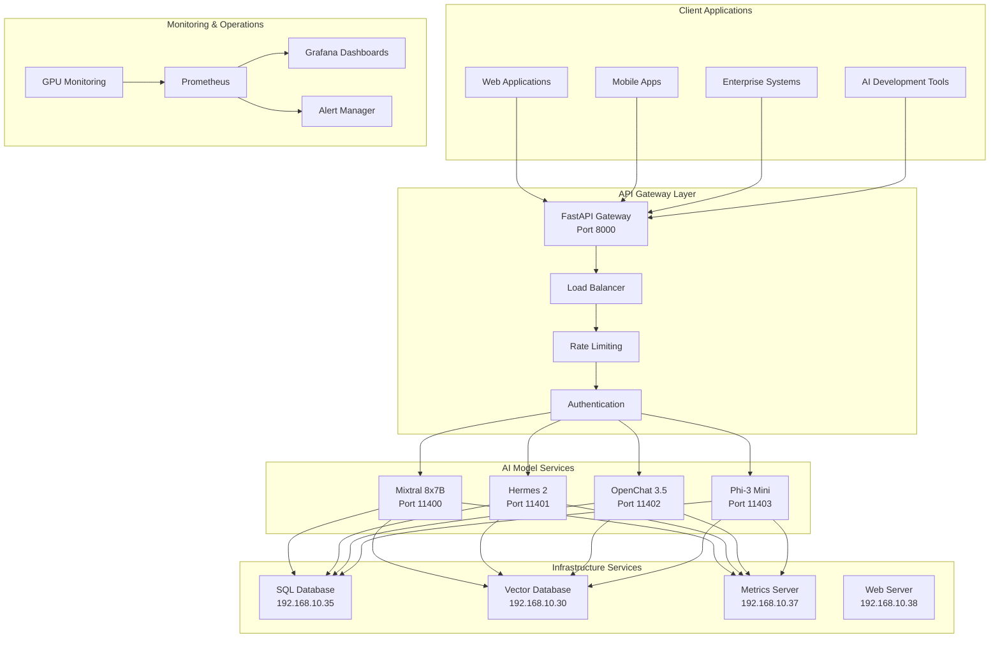
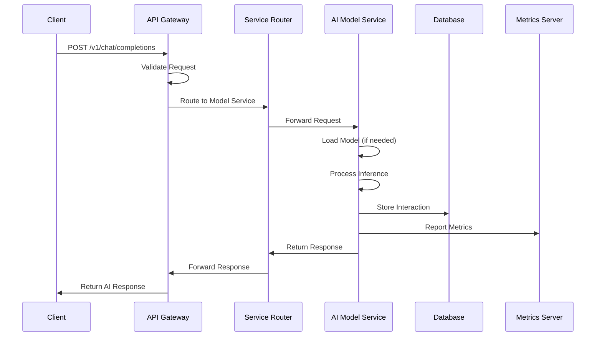
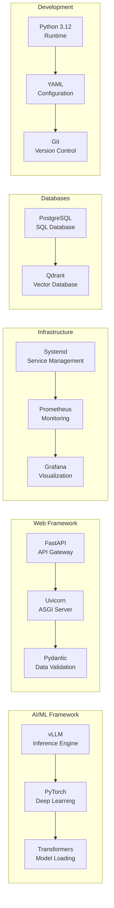
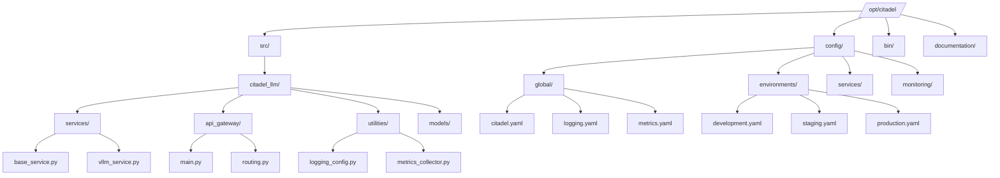
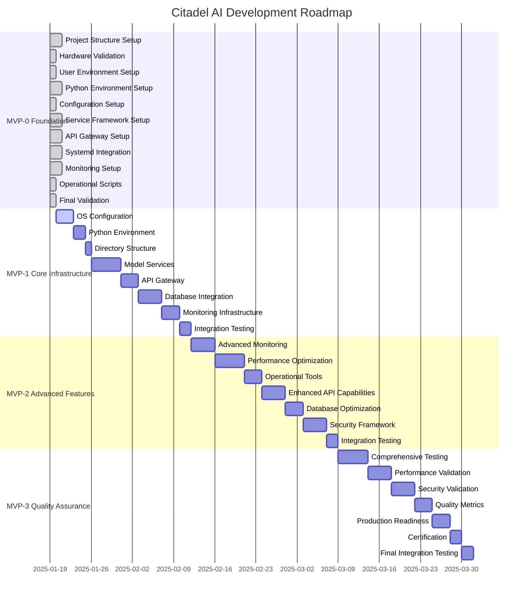
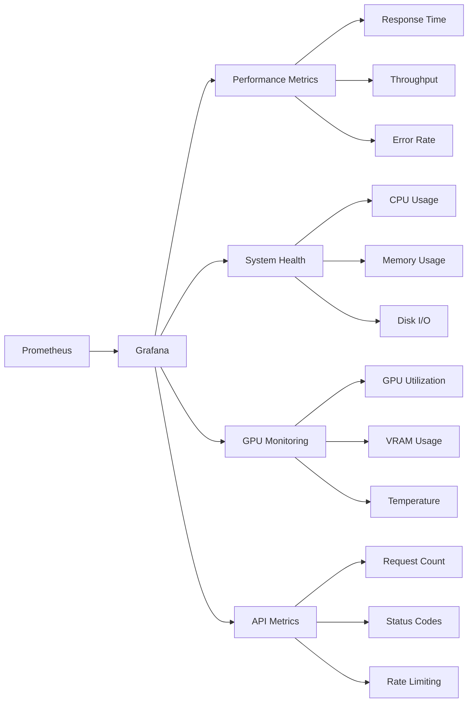

# 🏰 Citadel AI - HXP-Enterprise LLM Server

> **The Future of Enterprise AI Infrastructure**  
> *Building the next generation of scalable, secure, and intelligent AI model serving platforms*

[](https://opensource.org/licenses/MIT)
[](https://www.python.org/downloads/)
[](https://github.com/vllm-project/vllm)
[](https://fastapi.tiangolo.com/)
[](https://github.com/hanax-ai/Citadel-Enterprise-LLM-Server)

---

## 🌟 **Vision & Mission**

**Citadel AI** represents the pinnacle of enterprise AI infrastructure, designed to serve as the foundation for next-generation AI applications. Our mission is to democratize access to high-performance AI model serving while maintaining enterprise-grade security, scalability, and operational excellence.

### **🎯 Core Objectives**
- **🚀 Performance:** Ultra-low latency AI model inference with GPU optimization
- **🔒 Security:** Enterprise-grade security with comprehensive access controls
- **📈 Scalability:** Horizontal and vertical scaling capabilities
- **🛠️ Operational Excellence:** Comprehensive monitoring, logging, and management
- **🌐 Interoperability:** OpenAI-compatible API with seamless integration

---

## 🏗️ **System Architecture**

### **High-Level Architecture Overview**



### **Service Interaction Flow**



---

## 🚀 **Technology Stack**

### **Core Technologies**



### **Hardware Specifications**

| Component | Specification | Purpose |
|-----------|---------------|---------|
| **CPU** | AMD Ryzen Threadripper PRO 7965WX | High-performance processing |
| **Memory** | 256GB DDR5 ECC | Large model loading and caching |
| **GPU** | 2x NVIDIA RTX 5060 Ti (16GB VRAM each) | Parallel AI model inference |
| **Storage** | 3.6TB NVMe + 7.3TB Archive | Fast model storage and logs |
| **Network** | 10Gbps Ethernet | High-throughput API serving |

---

## 📁 **Project Structure**

### **Directory Architecture**



### **File Organization**

```
Citadel-Enterprise-LLM-Server/
├── 📋 .cursorrules                    # AI Assistant operational rules
├── 🏗️ EPIC-Enterprise-LLM-Server/     # Core project documentation
│   ├── 📄 0.1-HX-Enterprise-Server-Product-Document.md
│   ├── 🏛️ 0.2-HX-Enterprise-Server-Architecture.md
│   ├── 🚀 0.3-MVP-1-Core-Infrastructure-Features.md
│   ├── ⚡ 0.4-MVP-2-Advanced-Features.md
│   ├── 🎯 0.5-MVP-3-Quality-Assurance.md
│   ├── 🧪 0.6-MVP-1-End-to-End-Test-Plan.md
│   ├── 🔍 0.7-MVP-2-End-to-End-Test-Plan.md
│   ├── ✅ 0.8-MVP-3-End-to-End-Test-Plan.md
│   └── 📚 0.9-HX- Project-Structure-Setup-and-Usage-Guide.md
├── 🎯 Feature-Delivery/               # Implementation tasks
│   ├── 📋 MVP-0-Tasks/               # Foundation setup tasks
│   ├── 🚀 MVP-1-Tasks/               # Core infrastructure tasks
│   ├── ⚡ MVP-2-Tasks/               # Advanced feature tasks
│   └── 🎯 MVP-3-Tasks/               # Quality assurance tasks
└── 📖 X-Documents/                   # Templates and configuration
    ├── 📋 0.10-MVP-Task-Template.md
    └── ⚙️ 0.11-HX-LLM-Server-Configuration.md
```

---

## 🎯 **MVP Roadmap**

### **Development Phases**



### **Current Status: MVP-0 Foundation**

✅ **Completed:**
- Project structure and documentation
- AI Assistant operational rules (27 rules)
- MVP-0 implementation tasks (11 tasks)
- Server configuration documentation
- Task templates and standards

🔄 **In Progress:**
- Foundation setup and validation
- Hardware verification
- Environment configuration

📋 **Next Phase: MVP-1 Core Infrastructure**
- AI model service implementation
- Database integration
- API Gateway deployment
- Monitoring and logging setup

---

## 🚀 **Quick Start**

### **Prerequisites**

```bash
# System Requirements
- Ubuntu Server 24.04 LTS
- Python 3.12.3
- CUDA 12.9 compatible drivers
- 256GB RAM minimum
- Dual NVIDIA RTX 5060 Ti GPUs
```

### **Installation**

```bash
# Clone the repository
git clone https://github.com/hanax-ai/Citadel-Enterprise-LLM-Server.git
cd Citadel-Enterprise-LLM-Server

# Follow the setup guide
# See: EPIC-Enterprise-LLM-Server/0.9-HX- Project-Structure-Setup-and-Usage-Guide.md
```

### **Configuration**

```yaml
# Example configuration structure
/opt/citadel/config/
├── global/
│   ├── citadel.yaml          # Global settings
│   ├── logging.yaml          # Logging configuration
│   └── metrics.yaml          # Metrics configuration
├── environments/
│   ├── development.yaml      # Development environment
│   ├── staging.yaml          # Staging environment
│   └── production.yaml       # Production environment
└── services/
    ├── api_gateway.yaml      # API Gateway settings
    └── vllm_service.yaml     # vLLM service settings
```

---

## 🔧 **API Reference**

### **OpenAI-Compatible Endpoints**

```http
POST /v1/chat/completions
Content-Type: application/json

{
  "model": "mixtral-8x7b",
  "messages": [
    {"role": "user", "content": "Hello, how are you?"}
  ],
  "max_tokens": 100,
  "temperature": 0.7
}
```

### **Health Check Endpoints**

```http
GET /health                    # Overall system health
GET /health/models            # Model service status
GET /health/gpu               # GPU utilization
GET /metrics                  # Prometheus metrics
```

---

## 📊 **Performance Metrics**

### **Target Performance**

| Metric | Target | Current |
|--------|--------|---------|
| **Inference Latency** | < 100ms | TBD |
| **Throughput** | > 1000 req/sec | TBD |
| **GPU Utilization** | > 90% | TBD |
| **Memory Usage** | < 80% | TBD |
| **Uptime** | > 99.9% | TBD |

### **Monitoring Dashboard**



---

## 🤝 **Contributing**

We welcome contributions from the community! Please see our [Contributing Guidelines](CONTRIBUTING.md) for details.

### **Development Workflow**


### **Code Standards**

- **Python:** PEP 8 compliance
- **Documentation:** Comprehensive docstrings
- **Testing:** > 95% code coverage
- **Security:** OWASP guidelines
- **Performance:** Benchmark validation

---

## 📄 **License**

This project is licensed under the MIT License - see the [LICENSE](LICENSE) file for details.

---

## 🏆 **Acknowledgments**

- **vLLM Team** - For the incredible inference engine
- **FastAPI Community** - For the excellent web framework
- **PyTorch Team** - For the deep learning framework
- **OpenAI** - For the API compatibility standards

---

## 📞 **Support & Contact**

- **Documentation:** [Project Wiki](https://github.com/hanax-ai/Citadel-Enterprise-LLM-Server/wiki)
- **Issues:** [GitHub Issues](https://github.com/hanax-ai/Citadel-Enterprise-LLM-Server/issues)
- **Discussions:** [GitHub Discussions](https://github.com/hanax-ai/Citadel-Enterprise-LLM-Server/discussions)
- **Email:** jarvisr@hana-x.ai

---

<div align="center">

**🏰 Built with ❤️ by the Citadel AI Team**

*Empowering the future of enterprise AI infrastructure*

[](https://github.com/hanax-ai/Citadel-Enterprise-LLM-Server/stargazers)
[](https://github.com/hanax-ai/Citadel-Enterprise-LLM-Server/network/members)
[](https://github.com/hanax-ai/Citadel-Enterprise-LLM-Server/issues)

</div> 